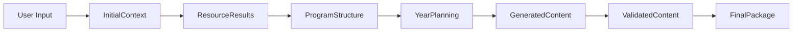

# 📊 STRUCTURES DE DONNÉES ET INTERFACES DÉTAILLÉES

## 🎯 Vue d'Ensemble des Flux de Données



---

## 📥 STRUCTURES D'ENTRÉE

### UserInput
```python
@dataclass
class UserInput:
    """Configuration initiale fournie par l'utilisateur"""
    level: str                          # "5ème", "4ème", "3ème"
    year: str                          # "2024-2025"
    curriculum: CurriculumType         # OFFICIAL | CUSTOM | HYBRID
    sessions_per_year: int             # 120-140
    
    # Contraintes spécifiques
    constraints: Dict[str, Any] = field(default_factory=lambda: {
        "holidays": List[DateRange],
        "evaluation_periods": List[Period],
        "special_needs": List[str],     # "DYS", "SEGPA", etc.
        "class_size": int,
        "equipment": List[str]          # "TBI", "tablets", etc.
    })
    
    # Préférences pédagogiques
    preferences: Dict[str, Any] = field(default_factory=lambda: {
        "teaching_style": TeachingStyle,  # TRADITIONAL | ACTIVE | FLIPPED
        "exercise_density": Density,      # LOW | MEDIUM | HIGH
        "difficulty_curve": Curve,        # LINEAR | PROGRESSIVE | ADAPTIVE
        "evaluation_frequency": str       # "weekly", "biweekly", "monthly"
    })
    
    # Options de génération
    generation_options: Dict[str, bool] = field(default_factory=lambda: {
        "include_corrections": True,
        "generate_variants": True,
        "create_digital_content": True,
        "differentiation": True,
        "teacher_guides": True
    })
```

### InitialContext
```python
@dataclass
class InitialContext:
    """Contexte enrichi après validation et préparation"""
    user_input: UserInput
    
    # Métadonnées système
    generation_id: UUID
    timestamp: datetime
    estimated_duration: timedelta
    
    # Configuration technique
    parallel_config: ParallelConfig = field(default_factory=lambda: {
        "max_workers": 10,
        "batch_size": 50,
        "timeout_seconds": 30,
        "retry_attempts": 3
    })
    
    # Ressources préchargées
    cached_resources: Dict[str, Any] = field(default_factory=dict)
    
    # Validation
    validation_status: ValidationStatus
    warnings: List[str] = field(default_factory=list)
```

---

## 🔍 MODULE 1: ResourceDiscovery - Structures de Sortie

### CrawlResults
```python
@dataclass
class CrawlResults:
    """Résultats agrégés du crawling multi-sources"""
    
    # Sources officielles
    eduscol: List[EduscolResource]
    bulletin_officiel: List[BOResource]
    
    # Sources académiques
    irem: List[IREMResource]
    academies: Dict[str, List[AcademicResource]]
    
    # Ressources complémentaires
    textbooks: List[TextbookResource]
    research_papers: List[ResearchPaper]
    teaching_materials: List[TeachingMaterial]
    
    # Métadonnées
    total_resources: int
    crawl_duration: timedelta
    sources_status: Dict[str, SourceStatus]
    
    def get_by_type(self, resource_type: ResourceType) -> List[Resource]:
        """Filtrer par type de ressource"""
        pass
    
    def get_by_topic(self, topic: str) -> List[Resource]:
        """Filtrer par sujet/chapitre"""
        pass
```

### Resource (Base)
```python
@dataclass
class Resource:
    """Classe de base pour toutes les ressources"""
    id: UUID
    title: str
    source: str
    url: str
    type: ResourceType
    level: str
    
    # Contenu
    content: ResourceContent
    
    # Métadonnées
    metadata: ResourceMetadata
    
    # Qualité et pertinence
    quality_score: float        # 0-1
    relevance_score: float      # 0-1
    official_status: bool
    
    # Extraction
    extracted_at: datetime
    parse_status: ParseStatus
```

### EduscolResource
```python
@dataclass
class EduscolResource(Resource):
    """Ressource spécifique Eduscol"""
    
    # Spécifique Eduscol
    resource_category: str      # "Cours", "Activité", "Évaluation"
    competencies_covered: List[str]
    
    # Contenu structuré
    pedagogical_scenario: Optional[PedagogicalScenario]
    teacher_guide: Optional[TeacherGuide]
    student_materials: Optional[StudentMaterials]
    
    # Liens avec programme
    program_links: List[ProgramLink]
    learning_objectives: List[LearningObjective]
```

### ParsedDocument
```python
@dataclass
class ParsedDocument:
    """Document parsé et structuré"""
    
    # Identification
    source_resource_id: UUID
    document_type: DocumentType
    
    # Structure extraite
    structure: DocumentStructure = field(default_factory=lambda: {
        "title": str,
        "sections": List[Section],
        "subsections": Dict[str, List[Subsection]],
        "hierarchy": TreeNode
    })
    
    # Contenu pédagogique extrait
    pedagogical_content: PedagogicalContent = field(default_factory=lambda: {
        "concepts": List[Concept],
        "definitions": List[Definition],
        "theorems": List[Theorem],
        "examples": List[Example],
        "exercises": List[Exercise],
        "methods": List[Method]
    })
    
    # Analyse NLP
    nlp_analysis: NLPAnalysis = field(default_factory=lambda: {
        "key_terms": List[Term],
        "difficulty_indicators": List[str],
        "prerequisite_mentions": List[str],
        "cognitive_load": float
    })
```

---

## 📚 MODULE 2: ProgramAnalyzer - Structures de Sortie

### ProgramStructure
```python
@dataclass
class ProgramStructure:
    """Structure complète du programme officiel analysé"""
    
    # Identification
    level: str
    year: str
    version: str
    
    # Compétences du socle
    competencies: CompetencyFramework = field(default_factory=lambda: {
        "chercher": Competency(
            name="Chercher",
            description="Extraire d'un document les informations utiles...",
            sub_competencies=[
                SubCompetency("S'engager dans une démarche scientifique"),
                SubCompetency("Observer, questionner, manipuler"),
                # ...
            ],
            evaluation_criteria=List[Criterion]
        ),
        "modéliser": Competency(...),
        "représenter": Competency(...),
        "raisonner": Competency(...),
        "calculer": Competency(...),
        "communiquer": Competency(...)
    })
    
    # Chapitres avec domaines associés (STRUCTURE REFACTORISÉE)
    chapters: List[Chapter] = field(default_factory=list)
    
    # Domaines mathématiques (référentiel)
    domains: Dict[str, DomainDefinition] = field(default_factory=lambda: {
        "nombres_et_calculs": DomainDefinition(
            name="Nombres et calculs",
            description="Comprendre et utiliser les nombres...",
            key_competencies=["calculer", "raisonner"]
        ),
        "organisation_et_gestion_de_donnees": DomainDefinition(
            name="Organisation et gestion de données, fonctions",
            description="Interpréter, représenter et traiter des données...",
            key_competencies=["représenter", "modéliser", "raisonner"]
        ),
        "grandeurs_et_mesures": DomainDefinition(
            name="Grandeurs et mesures",
            description="Comparer, estimer, mesurer des grandeurs...",
            key_competencies=["chercher", "calculer", "communiquer"]
        ),
        "espace_et_geometrie": DomainDefinition(
            name="Espace et géométrie",
            description="Représenter l'espace et utiliser les notions de géométrie...",
            key_competencies=["représenter", "raisonner", "communiquer"]
        ),
        "algorithmique_et_programmation": DomainDefinition(
            name="Algorithmique et programmation",
            description="Écrire, mettre au point et exécuter un programme...",
            key_competencies=["chercher", "modéliser", "représenter"]
        )
    })
    
    # Progressions et attendus
    learning_progressions: LearningProgressions
    end_of_cycle_expectations: List[Expectation]
    
    # Analyse des prérequis
    prerequisite_graph: PrerequisiteGraph
    
    # Ressources d'accompagnement
    accompanying_resources: List[Resource]
```

### Chapter (REFACTORISÉ)
```python
@dataclass
class Chapter:
    """Chapitre du programme avec domaines associés"""
    
    # Identification
    id: UUID
    title: str
    description: str
    
    # Domaines concernés avec pondération
    domain_weights: Dict[str, float] = field(default_factory=dict)
    # Exemple: {
    #     "nombres_et_calculs": 0.6,
    #     "grandeurs_et_mesures": 0.3,
    #     "organisation_et_gestion_de_donnees": 0.1
    # }
    
    # Caractéristiques pédagogiques
    estimated_hours: int
    suggested_period: List[int]  # Périodes 1-5
    
    # Contenu
    main_concepts: List[Concept]
    learning_objectives: List[LearningObjective]
    
    # Compétences travaillées
    competencies_focus: Dict[str, float]  # Pondération des compétences
    
    # Relations avec autres chapitres
    prerequisites: List[str]  # IDs des chapitres prérequis
    prepares_for: List[str]   # IDs des chapitres suivants
    
    # Difficultés et obstacles
    known_difficulties: List[Difficulty]
    didactic_obstacles: List[Obstacle]
    
    # Ressources spécifiques
    recommended_resources: List[Resource]
    
    def get_primary_domain(self) -> str:
        """Retourne le domaine principal (plus forte pondération)"""
        return max(self.domain_weights.items(), key=lambda x: x[1])[0]
    
    def get_all_domains(self) -> List[str]:
        """Retourne tous les domaines concernés"""
        return list(self.domain_weights.keys())
    
    def is_multidomain(self) -> bool:
        """Vérifie si le chapitre est transversal"""
        return len(self.domain_weights) > 1
```

### DomainDefinition (NOUVEAU)
```python
@dataclass
class DomainDefinition:
    """Définition d'un domaine mathématique"""
    name: str
    description: str
    key_competencies: List[str]
    
    # Méta-informations
    evaluation_weight: float = 0.2  # Poids dans l'évaluation globale
    color_code: str = "#000000"     # Pour visualisation
```

### ChapterExamples (EXEMPLES RÉALISTES)
```python
# Exemples de chapitres multi-domaines pour la 5ème

chapter_examples = [
    Chapter(
        title="Proportionnalité et pourcentages",
        domain_weights={
            "organisation_et_gestion_de_donnees": 0.5,
            "nombres_et_calculs": 0.3,
            "grandeurs_et_mesures": 0.2
        },
        estimated_hours=15,
        description="Reconnaître et utiliser la proportionnalité dans divers contextes"
    ),
    
    Chapter(
        title="Aires et périmètres",
        domain_weights={
            "grandeurs_et_mesures": 0.6,
            "espace_et_geometrie": 0.3,
            "nombres_et_calculs": 0.1
        },
        estimated_hours=12,
        description="Calculer et comparer des aires et périmètres de figures"
    ),
    
    Chapter(
        title="Statistiques et représentations",
        domain_weights={
            "organisation_et_gestion_de_donnees": 0.7,
            "nombres_et_calculs": 0.2,
            "algorithmique_et_programmation": 0.1
        },
        estimated_hours=10,
        description="Organiser et représenter des données statistiques"
    ),
    
    Chapter(
        title="Nombres relatifs",
        domain_weights={
            "nombres_et_calculs": 0.9,
            "algorithmique_et_programmation": 0.1
        },
        estimated_hours=14,
        description="Comprendre et manipuler les nombres négatifs"
    ),
    
    Chapter(
        title="Transformations géométriques",
        domain_weights={
            "espace_et_geometrie": 0.7,
            "algorithmique_et_programmation": 0.2,
            "grandeurs_et_mesures": 0.1
        },
        estimated_hours=11,
        description="Symétries, translations et rotations"
    )
]
```

### DidacticAnalysis
```python
@dataclass
class DidacticAnalysis:
    """Analyse didactique d'un concept"""
    concept: Concept
    
    # Obstacles épistémologiques
    epistemic_obstacles: List[EpistemicObstacle] = field(default_factory=lambda: [
        EpistemicObstacle(
            type="conceptual",
            description="Confusion entre opposé et inverse",
            manifestations=["Penser que l'opposé de 1/2 est 2"],
            remediation_strategies=[...]
        )
    ])
    
    # Erreurs types
    common_errors: List[CommonError] = field(default_factory=lambda: [
        CommonError(
            error_pattern="-3 + 5 = -8",
            cognitive_origin="Généralisation abusive de la règle des signes",
            frequency=0.4,  # 40% des élèves
            correction_approach="Utiliser la droite numérique"
        )
    ])
    
    # Recherche didactique
    research_insights: List[ResearchInsight]
    teaching_recommendations: List[Recommendation]
    
    # Progressions cognitives
    cognitive_stages: List[CognitiveStage]
    zone_of_proximal_development: ZPDAnalysis
```

---

## 📅 MODULE 3: YearPlanning - Structures de Sortie

### DetailedYearPlanning
```python
@dataclass
class DetailedYearPlanning:
    """Planning annuel complet et détaillé"""
    
    # Métadonnées
    academic_year: str
    level: str
    total_sessions: int
    
    # Structure temporelle
    periods: List[Period] = field(default_factory=lambda: [
        Period(
            number=1,
            name="Septembre-Octobre",
            start_date=date(2024, 9, 2),
            end_date=date(2024, 10, 18),
            weeks=7,
            sessions=28,
            chapters=[
                ChapterPlanning(
                    id=UUID(),
                    title="Nombres relatifs",
                    sessions_allocated=12,
                    sessions_detail=[
                        SessionPlanning(
                            number=1,
                            type=SessionType.DISCOVERY,
                            title="Découverte des nombres négatifs",
                            duration=55,
                            objectives=[...],
                            activities=[...]
                        ),
                        # ... autres sessions
                    ]
                )
            ],
            evaluations=[
                EvaluationPlanning(
                    type=EvaluationType.FORMATIVE,
                    session_number=15,
                    duration=30,
                    chapters_covered=["Nombres relatifs"]
                )
            ]
        ),
        # ... autres périodes
    ])
    
    # Vue par chapitre
    chapters_overview: List[ChapterOverview]
    
    # Évaluations planifiées
    evaluation_calendar: EvaluationCalendar
    
    # Temps tampons et remédiation
    buffer_sessions: List[BufferSession]
    remediation_slots: List[RemediationSlot]
    
    # Optimisations
    optimization_metrics: OptimizationMetrics
    
    # Analyse de couverture des domaines
    domain_coverage_analysis: DomainCoverageAnalysis
```

### DomainCoverageAnalysis (NOUVEAU)
```python
@dataclass
class DomainCoverageAnalysis:
    """Analyse de la couverture des domaines sur l'année"""
    
    # Heures totales par domaine
    total_hours_by_domain: Dict[str, float] = field(default_factory=dict)
    # Calculé en agrégeant les heures des chapitres × leurs pondérations
    
    # Pourcentage du temps annuel par domaine
    percentage_by_domain: Dict[str, float] = field(default_factory=dict)
    
    # Équilibre entre domaines
    balance_score: float  # 0-1, 1 = parfaitement équilibré
    
    # Progression temporelle
    domain_distribution_by_period: Dict[int, Dict[str, float]]
    
    # Alertes
    warnings: List[str] = field(default_factory=list)
    # Ex: "Le domaine 'algorithmique' ne représente que 5% du temps annuel"
    
    def is_balanced(self) -> bool:
        """Vérifie si la répartition respecte les recommandations officielles"""
        return self.balance_score > 0.8
```

### SessionPlanning
```python
@dataclass
class SessionPlanning:
    """Planification d'une séance spécifique"""
    
    # Identification
    session_id: UUID
    global_number: int          # 1-140
    chapter_number: int         # Position dans le chapitre
    
    # Temporel
    planned_date: Optional[date]
    duration_minutes: int = 55
    period: int                # 1-5
    
    # Type et contenu
    session_type: SessionType   # DISCOVERY | PRACTICE | EVALUATION | REMEDIATION
    title: str
    description: str
    
    # Objectifs pédagogiques
    learning_objectives: List[LearningObjective] = field(default_factory=list)
    competencies_worked: List[str] = field(default_factory=list)
    
    # Domaines travaillés dans cette séance
    domains_covered: Dict[str, float] = field(default_factory=dict)
    # Hérité du chapitre mais peut être ajusté pour certaines séances
    
    # Structure de la séance
    session_structure: SessionStructure = field(default_factory=lambda: {
        "warm_up": ActivitySlot(5, "Calcul mental ou rappels"),
        "homework_review": ActivitySlot(5, "Correction des devoirs"),
        "main_activity": ActivitySlot(20, "Activité principale"),
        "guided_practice": ActivitySlot(15, "Exercices guidés"),
        "independent_work": ActivitySlot(8, "Travail autonome"),
        "closure": ActivitySlot(2, "Bilan et devoirs")
    })
    
    # Ressources nécessaires
    required_materials: List[Material]
    prerequisites: List[Prerequisite]
    
    # Différenciation
    differentiation_plan: DifferentiationPlan
```

### ChapterPlanning
```python
@dataclass
class ChapterPlanning:
    """Planning détaillé d'un chapitre"""
    
    # Identification
    chapter_id: UUID
    title: str
    
    # Domaines (hérité du Chapter)
    domain_weights: Dict[str, float]
    
    # Temporel
    period: int
    start_session: int
    end_session: int
    total_sessions: int
    
    # Objectifs
    main_objectives: List[str]
    specific_objectives: Dict[str, List[str]]
    
    # Sessions détaillées
    sessions: List[SessionPlanning]
    
    # Progression interne
    learning_progression: LearningProgression = field(default_factory=lambda: {
        "phase_1": Phase("Découverte", sessions=[1, 2], focus="Intuition"),
        "phase_2": Phase("Construction", sessions=[3, 4, 5], focus="Formalisation"),
        "phase_3": Phase("Entraînement", sessions=[6, 7, 8], focus="Automatisation"),
        "phase_4": Phase("Approfondissement", sessions=[9, 10], focus="Complexification"),
        "phase_5": Phase("Évaluation", sessions=[11, 12], focus="Validation")
    })
    
    # Évaluations
    assessments: AssessmentPlan
    
    # Ressources
    resources_needed: List[Resource]
    digital_tools: List[DigitalTool]
    
    # Analyse transversale
    cross_domain_activities: List[CrossDomainActivity]
```

---

## 🎨 MODULE 4: ContentGeneration - Structures de Sortie

### CompleteYearContent
```python
@dataclass
class CompleteYearContent:
    """Ensemble complet du contenu généré pour l'année"""
    
    # Contenu par chapitre
    chapters_content: Dict[UUID, ChapterContent]
    
    # Exercices organisés
    exercise_bank: ExerciseBank = field(default_factory=lambda: {
        "by_chapter": Dict[UUID, List[Exercise]],
        "by_difficulty": Dict[Difficulty, List[Exercise]],
        "by_competency": Dict[str, List[Exercise]],
        "by_type": Dict[ExerciseType, List[Exercise]],
        "by_domain": Dict[str, List[Exercise]]  # NOUVEAU
    })
    
    # Évaluations
    evaluations: EvaluationSet = field(default_factory=lambda: {
        "diagnostic": List[DiagnosticEvaluation],
        "formative": List[FormativeEvaluation],
        "summative": List[SummativeEvaluation],
        "differentiated": Dict[str, List[Evaluation]],
        "multidomain": List[MultiDomainEvaluation]  # NOUVEAU
    })
    
    # Corrections
    corrections: Dict[UUID, Correction]
    
    # Guides enseignant
    teacher_materials: TeacherMaterials = field(default_factory=lambda: {
        "session_guides": Dict[int, SessionGuide],
        "chapter_guides": Dict[UUID, ChapterGuide],
        "differentiation_strategies": List[Strategy],
        "common_errors_guide": ErrorsGuide,
        "assessment_rubrics": Dict[UUID, Rubric],
        "cross_domain_connections": CrossDomainGuide  # NOUVEAU
    })
    
    # Ressources élèves
    student_materials: StudentMaterials
    
    # Métadonnées
    generation_metadata: GenerationMetadata
```

### ChapterContent
```python
@dataclass
class ChapterContent:
    """Contenu complet d'un chapitre"""
    
    # Identification
    chapter_id: UUID
    title: str
    domain_weights: Dict[str, float]  # NOUVEAU
    
    # Cours structuré
    course_content: CourseContent = field(default_factory=lambda: {
        "introduction": Introduction(
            hook="Situation motivante",
            real_world_connection="Application concrète",
            learning_objectives=List[str],
            domains_introduction=Dict[str, str]  # NOUVEAU: intro par domaine
        ),
        "sections": List[CourseSection],
        "synthesis": Synthesis(
            key_points=List[str],
            methods_summary=List[Method],
            common_pitfalls=List[str],
            domain_connections=Dict[str, List[str]]  # NOUVEAU
        ),
        "knowledge_map": ConceptMap
    })
    
    # Activités
    activities: Dict[SessionType, List[Activity]]
    
    # Exercices
    exercises: ExerciseCollection = field(default_factory=lambda: {
        "warm_ups": List[WarmUpExercise],
        "application": List[ApplicationExercise],
        "training": List[TrainingExercise],
        "problems": List[Problem],
        "challenges": List[Challenge],
        "cross_domain": List[CrossDomainExercise]  # NOUVEAU
    })
    
    # Évaluations du chapitre
    chapter_assessments: List[Assessment]
    
    # Supports visuels
    visual_aids: List[VisualAid]
    
    # Version LaTeX
    latex_source: str
    
    # Qualité
    quality_metrics: QualityMetrics
```

### Exercise
```python
@dataclass
class Exercise:
    """Structure d'un exercice"""
    
    # Identification
    exercise_id: UUID
    chapter_id: UUID
    number: int
    
    # Classification
    type: ExerciseType          # APPLICATION | TRAINING | PROBLEM | CHALLENGE
    difficulty: Difficulty      # EASY | MEDIUM | HARD | EXPERT
    estimated_time: int         # minutes
    
    # Domaines concernés (NOUVEAU)
    domains_involved: Dict[str, float] = field(default_factory=dict)
    # Ex: {"nombres_et_calculs": 0.7, "grandeurs_et_mesures": 0.3}
    
    # Contenu
    statement: ExerciseStatement = field(default_factory=lambda: {
        "context": Optional[str],
        "question": str,
        "sub_questions": Optional[List[str]],
        "given_data": Optional[Dict[str, Any]],
        "figure": Optional[Figure]
    })
    
    # Pédagogie
    learning_objectives: List[str]
    competencies_assessed: List[str]
    prerequisites: List[str]
    
    # Solution
    solution: Solution = field(default_factory=lambda: {
        "steps": List[SolutionStep],
        "final_answer": str,
        "verification": Optional[str],
        "common_errors": List[str],
        "hints": List[str],
        "domain_insights": Dict[str, str]  # NOUVEAU: insights par domaine
    })
    
    # Variantes
    variants: Optional[List[ExerciseVariant]]
    
    # Métadonnées
    tags: List[str]
    usage_stats: Optional[UsageStats]
    
    def is_multidomain(self) -> bool:
        """Vérifie si l'exercice touche plusieurs domaines"""
        return len(self.domains_involved) > 1
```

### CrossDomainExercise (NOUVEAU)
```python
@dataclass
class CrossDomainExercise(Exercise):
    """Exercice spécifiquement conçu pour travailler plusieurs domaines"""
    
    # Objectif transversal
    cross_domain_objective: str
    
    # Connexions explicites
    domain_connections: Dict[str, str] = field(default_factory=dict)
    # Ex: {
    #     "nombres_et_calculs": "Utiliser les pourcentages",
    #     "organisation_donnees": "Lire et interpréter un graphique",
    #     "grandeurs_mesures": "Convertir des unités"
    # }
    
    # Évaluation par domaine
    assessment_criteria_by_domain: Dict[str, List[Criterion]]
    
    # Exemple concret
    real_world_application: str
```

### Evaluation
```python
@dataclass
class Evaluation:
    """Structure d'une évaluation"""
    
    # Identification
    evaluation_id: UUID
    type: EvaluationType
    title: str
    
    # Temporel
    duration_minutes: int
    suggested_date: Optional[date]
    
    # Chapitres et domaines évalués (MODIFIÉ)
    chapters_evaluated: List[str]
    domains_coverage: Dict[str, float]  # NOUVEAU
    
    # Contenu
    instructions: EvaluationInstructions
    exercises: List[EvaluationExercise]
    
    # Barème
    grading_scheme: GradingScheme = field(default_factory=lambda: {
        "total_points": 20,
        "exercises_points": Dict[int, float],
        "competencies_grid": Dict[str, float],
        "domains_grid": Dict[str, float],  # NOUVEAU
        "bonus_points": Optional[float]
    })
    
    # Différenciation
    adapted_versions: Dict[str, AdaptedEvaluation]
    
    # Correction
    answer_key: AnswerKey
    grading_rubric: DetailedRubric
    
    # Analyse
    expected_results: ExpectedResults
    common_mistakes: List[CommonMistake]
    domain_analysis: DomainPerformanceAnalysis  # NOUVEAU
```

---

## ✅ MODULE 5: QualityAssurance - Structures

### ValidationReport
```python
@dataclass
class ValidationReport:
    """Rapport de validation complet"""
    
    # Identification
    content_id: UUID
    validation_timestamp: datetime
    
    # Scores globaux
    overall_score: float                    # 0-1
    passed: bool
    
    # Scores détaillés
    detailed_scores: Dict[str, float] = field(default_factory=lambda: {
        "academic_compliance": 0.0,         # Conformité programme
        "pedagogical_coherence": 0.0,       # Cohérence pédagogique
        "difficulty_progression": 0.0,      # Progression difficultés
        "content_completeness": 0.0,        # Exhaustivité
        "mathematical_accuracy": 0.0,       # Exactitude mathématique
        "language_quality": 0.0,            # Qualité rédactionnelle
        "accessibility": 0.0,               # Accessibilité
        "domain_balance": 0.0               # NOUVEAU: Équilibre des domaines
    })
    
    # Problèmes identifiés
    issues: List[ValidationIssue] = field(default_factory=list)
    
    # Suggestions d'amélioration
    improvement_suggestions: List[Suggestion] = field(default_factory=list)
    
    # Éléments à régénérer
    regeneration_requests: List[RegenerationRequest] = field(default_factory=list)
    
    # Analyse détaillée
    detailed_analysis: DetailedAnalysis
    
    # Analyse spécifique des domaines (NOUVEAU)
    domain_validation: DomainValidationReport
```

### DomainValidationReport (NOUVEAU)
```python
@dataclass
class DomainValidationReport:
    """Validation de la couverture et de l'équilibre des domaines"""
    
    # Couverture par domaine
    domain_coverage: Dict[str, float]  # Pourcentage du temps total
    
    # Conformité aux recommandations officielles
    official_compliance: Dict[str, bool]
    
    # Analyse de la progression
    domain_progression_quality: Dict[str, float]
    
    # Identification des déséquilibres
    imbalances: List[DomainImbalance] = field(default_factory=list)
    
    # Recommandations
    recommendations: List[str] = field(default_factory=list)
```

### ValidationIssue
```python
@dataclass
class ValidationIssue:
    """Problème identifié lors de la validation"""
    
    # Identification
    issue_id: UUID
    severity: Severity              # CRITICAL | HIGH | MEDIUM | LOW
    category: IssueCategory         # CONTENT | PEDAGOGY | TECHNICAL | COMPLIANCE | DOMAIN_BALANCE
    
    # Localisation
    location: ContentLocation = field(default_factory=lambda: {
        "content_type": str,        # "exercise", "course", "evaluation"
        "content_id": UUID,
        "section": Optional[str],
        "line_range": Optional[Tuple[int, int]]
    })
    
    # Description
    title: str
    description: str
    impact: str
    
    # Résolution
    suggested_fix: str
    automated_fix_available: bool
    fix_complexity: Complexity      # SIMPLE | MODERATE | COMPLEX
    
    # Contexte
    context: Dict[str, Any]
    examples: Optional[List[str]]
```

---

## 📤 MODULE 6: OutputAssembly - Structures Finales

### YearPackage
```python
@dataclass
class YearPackage:
    """Package complet livrable pour l'année"""
    
    # Métadonnées
    package_id: UUID
    generation_date: datetime
    academic_year: str
    level: str
    
    # Manuel enseignant
    teacher_handbook: TeacherHandbook = field(default_factory=lambda: {
        "year_overview": Document(
            title="Vue d'ensemble de l'année",
            sections=[
                "Progression annuelle",
                "Objectifs par période",
                "Stratégies pédagogiques",
                "Gestion de classe",
                "Approche multi-domaines"  # NOUVEAU
            ]
        ),
        "session_guides": List[SessionGuide],
        "assessment_package": AssessmentPackage,
        "differentiation_toolkit": DifferentiationToolkit,
        "digital_resources_guide": DigitalGuide,
        "cross_domain_connections": CrossDomainTeachingGuide  # NOUVEAU
    })
    
    # Matériel élève
    student_package: StudentPackage = field(default_factory=lambda: {
        "textbook": Textbook(
            chapters=List[FormattedChapter],
            appendices=List[Appendix],
            domain_index=DomainIndex  # NOUVEAU: index par domaine
        ),
        "workbook": Workbook(
            exercises_by_chapter=Dict[str, List[Exercise]],
            exercises_by_domain=Dict[str, List[Exercise]],  # NOUVEAU
            self_assessment_tools=List[Tool]
        ),
        "digital_access": DigitalAccess(
            platform_url=str,
            interactive_exercises=List[InteractiveExercise],
            videos=List[VideoResource]
        )
    })
    
    # Documents prêts à imprimer
    print_ready: PrintPackage = field(default_factory=lambda: {
        "courses_pdf": List[PDFDocument],
        "exercises_pdf": List[PDFDocument],
        "evaluations_pdf": List[PDFDocument],
        "corrections_pdf": List[PDFDocument],
        "all_in_one_pdf": PDFDocument
    })
    
    # Formats numériques
    digital_formats: DigitalFormats = field(default_factory=lambda: {
        "word_documents": List[DOCXDocument],
        "html_content": List[HTMLDocument],
        "latex_sources": List[TeXDocument],
        "scorm_packages": Optional[List[SCORMPackage]]
    })
    
    # Métadonnées de qualité
    quality_certificate: QualityCertificate
    generation_report: GenerationReport
    
    # Analyse transversale (NOUVEAU)
    cross_domain_analysis: CrossDomainAnalysisReport
```

### CrossDomainAnalysisReport (NOUVEAU)
```python
@dataclass
class CrossDomainAnalysisReport:
    """Rapport d'analyse des connexions entre domaines"""
    
    # Vue d'ensemble
    total_cross_domain_activities: int
    percentage_of_multidomain_content: float
    
    # Matrice de connexions
    domain_connection_matrix: Dict[Tuple[str, str], int]
    # Ex: {("nombres_calculs", "grandeurs_mesures"): 15}
    
    # Activités phares
    highlight_activities: List[CrossDomainHighlight]
    
    # Recommandations pédagogiques
    pedagogical_insights: List[str]
    
    # Graphique de connexions
    connection_graph: NetworkGraph
```

### Document
```python
@dataclass
class Document:
    """Structure de base d'un document"""
    
    # Identification
    document_id: UUID
    title: str
    type: DocumentType
    
    # Contenu
    content: Union[str, bytes]
    format: FileFormat              # PDF | DOCX | HTML | TEX
    
    # Structure
    table_of_contents: TableOfContents
    sections: List[Section]
    
    # Métadonnées
    metadata: DocumentMetadata = field(default_factory=lambda: {
        "author": "Math Content Generator",
        "created_date": datetime.now(),
        "version": "1.0",
        "language": "fr",
        "keywords": List[str],
        "description": str,
        "domains_covered": List[str]  # NOUVEAU
    })
    
    # Propriétés
    page_count: int
    word_count: int
    estimated_reading_time: int     # minutes
    
    # Accessibilité
    accessibility_features: AccessibilityFeatures
```

---

## 🔄 INTERFACES DE COMMUNICATION INTER-MODULES

### Module Communication Protocol

```python
class ModuleCommunicationProtocol:
    """Protocole de communication standardisé entre modules"""
    
    @dataclass
    class Request:
        """Requête inter-module"""
        request_id: UUID
        source_module: str
        target_module: str
        operation: str
        parameters: Dict[str, Any]
        priority: Priority
        timeout: Optional[int]
        
    @dataclass
    class Response:
        """Réponse inter-module"""
        request_id: UUID
        status: ResponseStatus      # SUCCESS | ERROR | PARTIAL
        data: Optional[Any]
        errors: List[Error]
        warnings: List[Warning]
        processing_time: timedelta
        
    @dataclass
    class Event:
        """Événement asynchrone"""
        event_id: UUID
        event_type: str
        source_module: str
        timestamp: datetime
        payload: Dict[str, Any]
```

### Error Handling

```python
@dataclass
class Error:
    """Structure d'erreur standardisée"""
    error_code: str
    message: str
    severity: Severity
    module: str
    stacktrace: Optional[str]
    recovery_suggestions: List[str]
    
@dataclass
class Warning:
    """Structure d'avertissement"""
    warning_code: str
    message: str
    impact: str
    mitigation: Optional[str]
```

---

## 📊 MÉTRIQUES ET MONITORING

### GenerationMetrics

```python
@dataclass
class GenerationMetrics:
    """Métriques complètes de génération"""
    
    # Performance
    performance: PerformanceMetrics = field(default_factory=lambda: {
        "total_duration": timedelta,
        "phase_durations": Dict[str, timedelta],
        "api_calls": {
            "total": int,
            "by_module": Dict[str, int],
            "parallel_peak": int,
            "cache_hits": int
        },
        "resource_usage": {
            "peak_memory_gb": float,
            "cpu_time_seconds": float,
            "disk_usage_mb": float
        }
    })
    
    # Qualité
    quality: QualityMetrics = field(default_factory=lambda: {
        "validation_scores": Dict[str, float],
        "regeneration_count": int,
        "issues_found": int,
        "issues_fixed": int,
        "final_quality_score": float,
        "domain_balance_score": float  # NOUVEAU
    })
    
    # Volume
    volume: VolumeMetrics = field(default_factory=lambda: {
        "chapters_generated": int,
        "sessions_created": int,
        "exercises_total": int,
        "evaluations_total": int,
        "pages_generated": int,
        "words_written": int,
        "multidomain_content_percentage": float  # NOUVEAU
    })
    
    # Coûts
    costs: CostMetrics = field(default_factory=lambda: {
        "api_cost_usd": float,
        "compute_cost_usd": float,
        "total_cost_usd": float,
        "cost_per_chapter": float,
        "cost_per_session": float
    })
```

---

Ce document détaille l'ensemble des structures de données et interfaces qui permettent la communication fluide entre tous les modules du système, garantissant ainsi la génération complète et cohérente d'une année de contenus pédagogiques avec une approche multi-domaines réaliste.