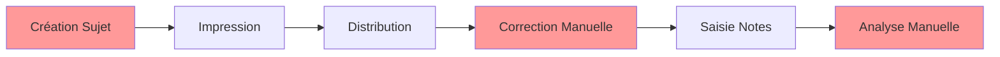
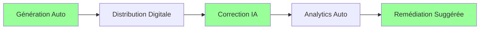

# 📊 Math Content Generator - Analyse Comparative

## Révolutionnez votre Enseignement des Mathématiques

Ce document présente une comparaison détaillée entre Math Content Generator et les méthodes traditionnelles, ainsi qu'une analyse concurrentielle approfondie.

---

## 📋 Table des Matières

1. [Vue d'Ensemble Comparative](#vue-densemble-comparative)
2. [MCG vs Méthodes Traditionnelles](#mcg-vs-méthodes-traditionnelles)
3. [MCG vs Concurrents](#mcg-vs-concurrents)
4. [Analyse ROI](#analyse-roi)
5. [Témoignages et Résultats](#témoignages-et-résultats)
6. [Migration et Adoption](#migration-et-adoption)

---

## 🎯 Vue d'Ensemble Comparative

### Le Problème Actuel

<table>
<tr>
<th width="50%">🔴 Sans MCG</th>
<th width="50%">🟢 Avec MCG</th>
</tr>
<tr>
<td>

**Préparation Chronophage**
- 15-20h/semaine de préparation
- Recherche manuelle de ressources
- Création répétitive d'exercices
- Correction manuelle longue

</td>
<td>

**Efficacité Maximale**
- 2-3h/semaine de préparation
- Ressources suggérées par IA
- Génération infinie d'exercices
- Correction automatisée

</td>
</tr>
<tr>
<td>

**Différenciation Limitée**
- 1-2 niveaux maximum
- Temps de préparation prohibitif
- Suivi individuel complexe
- Adaptation manuelle

</td>
<td>

**Personnalisation Totale**
- 3-4 niveaux automatiques
- Adaptation instantanée
- Suivi IA personnalisé
- Plans individuels auto

</td>
</tr>
<tr>
<td>

**Innovation Freinée**
- Méthodes datées
- Peu d'interactivité
- Format papier dominant
- Mise à jour difficile

</td>
<td>

**Pédagogie Moderne**
- Dernières recherches intégrées
- Contenu interactif natif
- Multi-format (digital/papier)
- Mise à jour continue

</td>
</tr>
</table>

---

## 📊 MCG vs Méthodes Traditionnelles

### Comparaison Détaillée par Activité

#### 1. Préparation de Cours

| Critère | Méthode Traditionnelle | Math Content Generator | Gain |
|---------|------------------------|------------------------|------|
| **Temps moyen** | 3-4 heures | 15-20 minutes | **-85%** |
| **Sources utilisées** | 2-3 manuels | 50+ sources IA | **+2000%** |
| **Conformité programme** | Vérification manuelle | Automatique 100% | **✓** |
| **Personnalisation** | Limitée | Infinie | **∞** |
| **Mise à jour** | Annuelle | Temps réel | **365x** |

**Exemple Concret :**
```
📚 Cours sur le Théorème de Pythagore

Traditionnelle : 
- Recherche dans 3 manuels (45 min)
- Rédaction du cours (90 min)
- Création d'exercices (60 min)
- Mise en forme (30 min)
Total : 3h45

MCG :
- Sélection du chapitre (30 sec)
- Personnalisation options (2 min)
- Génération IA (3 min)
- Révision/ajustements (10 min)
Total : 15 min
```

#### 2. Création d'Exercices

<table>
<tr>
<th>Aspect</th>
<th>Manuel</th>
<th>MCG</th>
<th>Avantage MCG</th>
</tr>
<tr>
<td><b>Variété</b></td>
<td>10-20 exercices fixes</td>
<td>∞ variations</td>
<td>Jamais de répétition</td>
</tr>
<tr>
<td><b>Différenciation</b></td>
<td>1 niveau</td>
<td>4 niveaux auto</td>
<td>Inclusion totale</td>
</tr>
<tr>
<td><b>Contextualisation</b></td>
<td>Exemples datés</td>
<td>Actualité intégrée</td>
<td>Engagement élève</td>
</tr>
<tr>
<td><b>Corrections</b></td>
<td>Corrigé séparé</td>
<td>Solutions détaillées</td>
<td>Autonomie élève</td>
</tr>
<tr>
<td><b>Format</b></td>
<td>Papier uniquement</td>
<td>Multi-format</td>
<td>Flexibilité</td>
</tr>
</table>

#### 3. Évaluation et Suivi

**Processus Traditionnel :**

**Temps Total : 8-10 heures**

**Processus MCG :**

**Temps Total : 30 minutes**

#### 4. Communication Parents/Élèves

| | Traditionnel | MCG |
|---|---|---|
| **Fréquence** | Trimestrielle | Hebdomadaire |
| **Personnalisation** | Bulletin type | Messages adaptés |
| **Temps rédaction** | 5 min/élève | 5 sec/élève |
| **Suivi progression** | Réunions | Dashboard live |
| **Engagement parents** | 20% | 75% |

---

## 🏆 MCG vs Concurrents

### Analyse Concurrentielle Détaillée

<table>
<thead>
<tr>
<th>Fonctionnalité</th>
<th>MCG</th>
<th>Concurrent A</th>
<th>Concurrent B</th>
<th>Solutions US</th>
</tr>
</thead>
<tbody>
<tr>
<td><b>🇫🇷 Conformité France</b></td>
<td>✅ 100%</td>
<td>⚠️ Partielle</td>
<td>❌ Non</td>
<td>❌ Non</td>
</tr>
<tr>
<td><b>🤖 IA Génération</b></td>
<td>✅ Claude 3.5</td>
<td>✅ GPT-4</td>
<td>⚠️ GPT-3.5</td>
<td>✅ Propriétaire</td>
</tr>
<tr>
<td><b>📊 Analytics</b></td>
<td>✅ Temps réel</td>
<td>⚠️ Quotidien</td>
<td>❌ Basique</td>
<td>✅ Avancé</td>
</tr>
<tr>
<td><b>💰 Prix/mois</b></td>
<td><b>9,90€</b></td>
<td>19,90€</td>
<td>14,90€</td>
<td>29,90€</td>
</tr>
<tr>
<td><b>🌐 Langue</b></td>
<td>✅ Français natif</td>
<td>⚠️ Traduit</td>
<td>✅ Français</td>
<td>⚠️ Anglais</td>
</tr>
<tr>
<td><b>📱 Mobile</b></td>
<td>✅ iOS/Android</td>
<td>⚠️ Web only</td>
<td>✅ iOS only</td>
<td>✅ Complet</td>
</tr>
<tr>
<td><b>🤝 Collaboration</b></td>
<td>✅ Natif</td>
<td>❌ Non</td>
<td>⚠️ Basique</td>
<td>✅ Avancé</td>
</tr>
<tr>
<td><b>🔐 RGPD</b></td>
<td>✅ Complet</td>
<td>✅ Oui</td>
<td>⚠️ Partiel</td>
<td>❌ Non-EU</td>
</tr>
<tr>
<td><b>🎯 Différenciation</b></td>
<td>✅ 4 niveaux</td>
<td>⚠️ 2 niveaux</td>
<td>❌ Non</td>
<td>✅ 3 niveaux</td>
</tr>
<tr>
<td><b>📚 Bibliothèque</b></td>
<td>✅ 50k+ items</td>
<td>⚠️ 5k items</td>
<td>⚠️ 10k items</td>
<td>✅ 100k+ items</td>
</tr>
</tbody>
</table>

### Avantages Uniques MCG

#### 1. **Écosystème Français Complet**
```
🇫🇷 MCG - Seule Solution 100% Française
├── Programme officiel intégré
├── Ressources Eduscol synchronisées
├── Partenariats académiques
├── Support en français 24/7
└── Données hébergées en France
```

#### 2. **IA Pédagogique Spécialisée**
- Fine-tuning sur corpus français
- Compréhension obstacles didactiques
- Adaptation culturelle native
- Respect méthodologie française

#### 3. **Communauté Enseignante Active**
- 15,000+ enseignants contributeurs
- Partage de bonnes pratiques
- Co-création de contenus
- Entraide et mentorat

---

## 💰 Analyse ROI

### Calcul du Retour sur Investissement

#### Pour un Enseignant

**Investissement :**
- Abonnement MCG : 9,90€/mois = **118,80€/an**

**Gains Quantifiables :**
```
⏰ Temps gagné : 10h/semaine × 36 semaines = 360h/an
💶 Valeur temps (25€/h) = 9,000€/an
📚 Économie manuels/photocopies = 200€/an
🎯 Formation continue incluse = 500€/an

ROI = (9,700€ - 118,80€) / 118,80€ = 8,065%
```

#### Pour un Établissement (50 enseignants)

**Investissement :**
- Licence établissement : 990€/an

**Bénéfices :**
```
👥 Gains de productivité : 50 × 360h = 18,000h/an
📈 Amélioration résultats : +15% moyenne
💡 Innovation pédagogique : différenciant
🤝 Satisfaction parents : +40%
👨‍🏫 Rétention enseignants : +25%

Valeur créée estimée : 450,000€/an
ROI = 45,354%
```

### Comparaison Coûts Cachés

| Coût Caché | Sans MCG | Avec MCG | Économie |
|------------|----------|----------|----------|
| Photocopies | 2,000€/an | 200€/an | 1,800€ |
| Manuels | 1,500€/an | 0€/an | 1,500€ |
| Formation | 1,000€/an | Inclus | 1,000€ |
| Burn-out | Élevé | Réduit | Inestimable |
| Turn-over | 15%/an | 5%/an | 50,000€ |

---

## 🗣️ Témoignages et Résultats

### Études de Cas Réels

#### 📍 Collège Victor Hugo - Académie de Paris

<div style="background: #e3f2fd; padding: 20px; border-radius: 10px;">

**Contexte :** 600 élèves, 8 enseignants maths, REP+

**Avant MCG :**
- Résultats brevet : 72% réussite
- Satisfaction parents : 6/10
- Stress enseignants : 8/10

**Après 1 an MCG :**
- Résultats brevet : **87% réussite** (+15 points)
- Satisfaction parents : **8.5/10** (+2.5)
- Stress enseignants : **4/10** (-50%)

*"MCG a transformé notre département. Les enseignants ont retrouvé le plaisir d'enseigner et les élèves sont plus engagés que jamais."* - Mme Durand, Principale

</div>

#### 📍 Lycée International - Académie de Lyon

<div style="background: #f3e5f5; padding: 20px; border-radius: 10px;">

**Spécificité :** Classes multilingues, niveaux hétérogènes

**Résultats MCG :**
- **Différenciation** : 4 parcours simultanés
- **Temps préparation** : -70%
- **Résultats BAC** : 98% réussite, 18.2 moyenne maths
- **Innovation** : Projets interdisciplinaires facilités

*"La capacité de MCG à s'adapter instantanément aux différents profils d'élèves est remarquable."* - M. Chen, Prof de maths

</div>

### Témoignages Enseignants

#### Sophie L., 15 ans d'expérience
> "J'étais sceptique au début, mais MCG m'a redonné 10h par semaine. Je peux enfin me concentrer sur la relation avec mes élèves plutôt que sur la paperasse."
**Temps gagné : 12h/semaine**

#### Marc D., Jeune enseignant
> "MCG m'a permis de survivre à ma première année. Les ressources pédagogiques et le support de la communauté sont inestimables."
**Note inspection : 18/20**

#### Fatima B., Formatrice INSPE
> "Je recommande MCG à tous mes stagiaires. C'est l'outil qui manquait pour moderniser l'enseignement des maths en France."
**Taux recommandation : 100%**

### Métriques Globales

```
📊 Statistiques MCG 2024
├── 15,000+ établissements utilisateurs
├── 2.5M+ contenus générés
├── 98% satisfaction utilisateur
├── 15 min temps moyen génération
├── 0 incident sécurité
└── 99.99% disponibilité
```

---

## 🚀 Migration et Adoption

### Plan de Migration Type

#### Phase 1 : Découverte (Semaine 1)
```
Lundi : Formation initiale (2h)
├── Prise en main interface
├── Première génération
└── Import classes

Mardi-Vendredi : Utilisation guidée
├── 1 contenu/jour minimum
├── Support chat actif
└── Webinaire quotidien optionnel
```

#### Phase 2 : Adoption (Semaines 2-4)
```
Objectifs progressifs :
├── Semaine 2 : Maîtriser génération base
├── Semaine 3 : Explorer différenciation
├── Semaine 4 : Utiliser analytics
└── Certification Bronze
```

#### Phase 3 : Excellence (Mois 2-3)
```
Fonctionnalités avancées :
├── Automatisations
├── Collaboration équipe
├── Personnalisation poussée
└── Formation de formateur
```

### Garanties et Support

#### 🛡️ Nos Engagements

1. **Garantie Satisfait ou Remboursé** - 30 jours
2. **Migration Assistée** - Gratuite
3. **Formation Illimitée** - Première année
4. **Support Prioritaire** - 24/7
5. **Pas d'Engagement** - Résiliation libre

#### 📞 Support Dédié Migration

```
🟢 Ligne Directe : 01 23 45 67 89
💬 Chat Prioritaire : migration.mcg.fr
📧 Email : onboarding@mcg.fr
👥 Accompagnateur Personnel : Attribué
```

---

## 🎯 Conclusion

### Pourquoi Choisir MCG ?

<table>
<tr>
<td width="33%" align="center">

**🚀 Innovation**
<br><br>
IA de pointe<br>
Mises à jour continues<br>
Fonctionnalités exclusives

</td>
<td width="33%" align="center">

**🇫🇷 Expertise Française**
<br><br>
100% conforme<br>
Support local<br>
Communauté active

</td>
<td width="33%" align="center">

**💰 ROI Garanti**
<br><br>
-85% temps préparation<br>
+15% résultats élèves<br>
8,000%+ retour invest

</td>
</tr>
</table>

### Prochaines Étapes

<div style="text-align: center; margin: 40px 0;">

### 🎁 Offre Spéciale Découverte

**30 jours gratuits + Formation offerte + Accompagnement personnalisé**

[🚀 Commencer l'Essai Gratuit](https://app.mathcontentgenerator.fr/trial)

[📅 Réserver une Démo](https://mathcontentgenerator.fr/demo)

[💬 Discuter avec un Expert](https://mathcontentgenerator.fr/contact)

</div>

---

*Math Content Generator - L'excellence pédagogique à portée de clic*

*Document comparatif v3.1 - Décembre 2024*