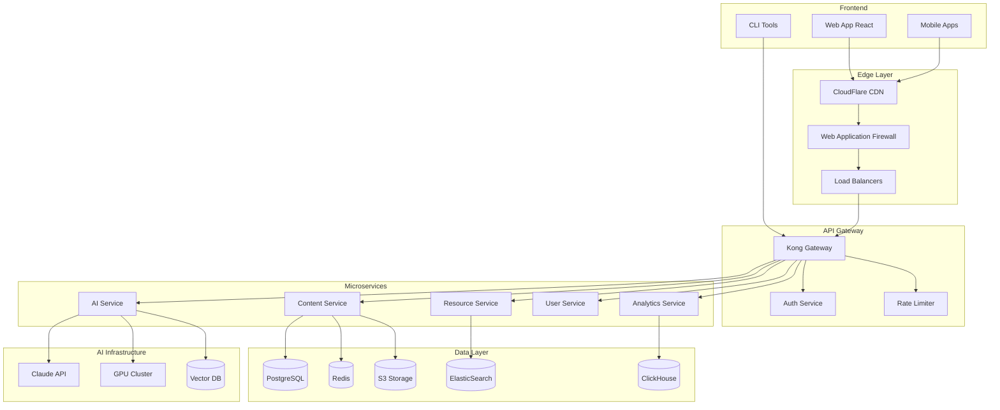

# 🏗️ Math Content Generator - Architecture Technique

## Vue d'Ensemble

Ce document décrit l'architecture technique complète de la plateforme Math Content Generator, conçue pour servir 100,000+ utilisateurs simultanés avec une disponibilité de 99.99%.

---

## 📋 Table des Matières

1. [Architecture Globale](#architecture-globale)
2. [Infrastructure Cloud](#infrastructure-cloud)
3. [Microservices](#microservices)
4. [Base de Données](#base-de-données)
5. [Système d'IA](#système-dia)
6. [Sécurité](#sécurité)
7. [Performance et Scalabilité](#performance-et-scalabilité)
8. [Monitoring et Observabilité](#monitoring-et-observabilité)
9. [CI/CD et DevOps](#cicd-et-devops)
10. [Disaster Recovery](#disaster-recovery)

---

## 🌐 Architecture Globale

### Vue Haut Niveau



### Stack Technologique

| Couche | Technologies |
|--------|-------------|
| **Frontend** | React 18, Next.js 14, TypeScript, TailwindCSS |
| **Mobile** | React Native, Expo, Native modules |
| **Backend** | Python 3.11+, FastAPI, Node.js, Go |
| **Databases** | PostgreSQL 15, Redis 7, MongoDB 6 |
| **AI/ML** | PyTorch, Transformers, LangChain, Claude API |
| **Infrastructure** | Kubernetes, Docker, Terraform |
| **Monitoring** | Prometheus, Grafana, ELK Stack |
| **CI/CD** | GitLab CI, ArgoCD, Helm |

---

## ☁️ Infrastructure Cloud

### Architecture Multi-Cloud

```yaml
providers:
  primary:
    provider: AWS
    regions:
      - eu-west-3  # Paris (Primary)
      - eu-west-1  # Ireland (Backup)
    services:
      - EKS (Kubernetes)
      - RDS (PostgreSQL)
      - S3 (Object Storage)
      - CloudFront (CDN)
      - Lambda (Serverless)
      
  secondary:
    provider: OVHcloud
    regions:
      - rbx  # Roubaix
      - sbg  # Strasbourg
    purpose: Data sovereignty & compliance
    
  cdn:
    provider: Cloudflare
    features:
      - Global CDN
      - DDoS Protection
      - WAF
      - Workers (Edge Computing)
```

### Infrastructure as Code

```hcl
# terraform/main.tf
module "kubernetes_cluster" {
  source = "./modules/eks"
  
  cluster_name     = "mcg-production"
  cluster_version  = "1.28"
  
  node_groups = {
    general = {
      instance_types = ["t3.xlarge"]
      min_size      = 3
      max_size      = 10
      desired_size  = 5
    }
    
    gpu = {
      instance_types = ["g4dn.xlarge"]
      min_size      = 0
      max_size      = 5
      desired_size  = 2
      taints = [{
        key    = "nvidia.com/gpu"
        value  = "true"
        effect = "NO_SCHEDULE"
      }]
    }
  }
}
```

---

## 🔧 Microservices

### Content Service

```python
# services/content/main.py
from fastapi import FastAPI, Depends
from sqlalchemy.ext.asyncio import AsyncSession
import asyncio

app = FastAPI(title="Content Service", version="3.0.0")

class ContentService:
    def __init__(self):
        self.cache = RedisCache()
        self.db = DatabasePool()
        self.ai_client = AIServiceClient()
        
    async def generate_content(
        self, 
        request: ContentRequest,
        user: User = Depends(get_current_user)
    ) -> ContentResponse:
        # Check cache first
        cached = await self.cache.get(request.cache_key)
        if cached:
            return cached
            
        # Generate new content
        async with self.db.get_session() as session:
            # Validate request
            await self.validate_request(request, user, session)
            
            # Call AI service
            ai_response = await self.ai_client.generate(
                prompt=request.to_prompt(),
                model=self.select_model(request),
                temperature=request.temperature
            )
            
            # Post-process and validate
            content = await self.post_process(ai_response, request)
            await self.validate_content(content)
            
            # Save to database
            db_content = await self.save_content(content, user, session)
            
            # Cache result
            await self.cache.set(
                request.cache_key, 
                content, 
                ttl=3600
            )
            
            return ContentResponse.from_db(db_content)

@app.post("/api/v3/content/generate")
async def generate_content(
    request: ContentRequest,
    service: ContentService = Depends()
):
    return await service.generate_content(request)
```

### AI Service Architecture

```python
# services/ai/architecture.py
class AIServiceArchitecture:
    """
    Distributed AI processing with multiple models
    """
    
    def __init__(self):
        self.models = {
            "claude-3-5-sonnet": ClaudeClient(),
            "gpt-4-turbo": OpenAIClient(),
            "mixtral-8x7b": LocalLLMClient(),
            "mathbert": FineTunedModel()
        }
        
        self.router = ModelRouter()
        self.queue = TaskQueue()
        self.monitor = PerformanceMonitor()
        
    async def process_request(self, request: AIRequest) -> AIResponse:
        # Route to appropriate model
        model = self.router.select_model(
            task_type=request.task_type,
            priority=request.priority,
            cost_sensitivity=request.cost_sensitivity
        )
        
        # Queue for processing
        task = await self.queue.enqueue(
            model=model,
            request=request,
            priority=request.priority
        )
        
        # Process with monitoring
        with self.monitor.track(task):
            response = await model.generate(request)
            
        # Validate and return
        await self.validate_response(response)
        return response
```

### Service Mesh Configuration

```yaml
# istio/virtual-service.yaml
apiVersion: networking.istio.io/v1beta1
kind: VirtualService
metadata:
  name: content-service
spec:
  hosts:
  - content
  http:
  - match:
    - headers:
        x-version:
          exact: v3
    route:
    - destination:
        host: content
        subset: v3
      weight: 100
  - route:
    - destination:
        host: content
        subset: v2
      weight: 90
    - destination:
        host: content
        subset: v3
      weight: 10
---
apiVersion: networking.istio.io/v1beta1
kind: DestinationRule
metadata:
  name: content-service
spec:
  host: content
  trafficPolicy:
    connectionPool:
      tcp:
        maxConnections: 100
      http:
        http1MaxPendingRequests: 50
        http2MaxRequests: 100
    loadBalancer:
      consistentHash:
        httpCookie:
          name: "session"
          ttl: 3600s
  subsets:
  - name: v2
    labels:
      version: v2
  - name: v3
    labels:
      version: v3
```

---

## 🗄️ Base de Données

### Architecture Multi-Base

```sql
-- PostgreSQL: Main transactional data
CREATE TABLE contents (
    id UUID PRIMARY KEY DEFAULT gen_random_uuid(),
    user_id UUID NOT NULL REFERENCES users(id),
    type content_type NOT NULL,
    level education_level NOT NULL,
    chapter TEXT NOT NULL,
    content JSONB NOT NULL,
    metadata JSONB DEFAULT '{}',
    compliance_score DECIMAL(3,2),
    created_at TIMESTAMPTZ DEFAULT NOW(),
    updated_at TIMESTAMPTZ DEFAULT NOW(),
    
    -- Partitioning by creation date
    PARTITION BY RANGE (created_at)
);

-- Create monthly partitions
CREATE TABLE contents_2024_01 PARTITION OF contents
    FOR VALUES FROM ('2024-01-01') TO ('2024-02-01');

-- Indexes for performance
CREATE INDEX idx_contents_user_created ON contents(user_id, created_at DESC);
CREATE INDEX idx_contents_metadata ON contents USING GIN(metadata);
CREATE INDEX idx_contents_search ON contents USING GIN(to_tsvector('french', content));
```

### Redis Architecture

```python
# cache/redis_architecture.py
class RedisArchitecture:
    """
    Multi-tier caching strategy
    """
    
    def __init__(self):
        # Different Redis instances for different purposes
        self.cache_pools = {
            'hot': RedisPool(  # Frequently accessed data
                host='redis-hot.internal',
                max_memory='32GB',
                eviction_policy='allkeys-lru',
                persistence='no'
            ),
            'warm': RedisPool(  # Less frequent data
                host='redis-warm.internal',
                max_memory='64GB',
                eviction_policy='volatile-lru',
                persistence='aof'
            ),
            'session': RedisPool(  # User sessions
                host='redis-session.internal',
                max_memory='16GB',
                eviction_policy='volatile-ttl',
                persistence='rdb'
            ),
            'queue': RedisPool(  # Task queues
                host='redis-queue.internal',
                max_memory='8GB',
                persistence='aof'
            )
        }
        
    async def get(self, key: str, tier: str = 'hot') -> Any:
        # Try hot cache first
        value = await self.cache_pools['hot'].get(key)
        if value:
            return value
            
        # Try warm cache
        if tier in ['warm', 'all']:
            value = await self.cache_pools['warm'].get(key)
            if value:
                # Promote to hot cache
                await self.cache_pools['hot'].set(key, value, ttl=3600)
                return value
                
        return None
```

### Vector Database for AI

```python
# vectordb/architecture.py
from qdrant_client import QdrantClient
from sentence_transformers import SentenceTransformer

class VectorDBArchitecture:
    """
    Vector database for semantic search and AI
    """
    
    def __init__(self):
        self.client = QdrantClient(
            host="qdrant.internal",
            port=6333,
            grpc_port=6334,
            prefer_grpc=True
        )
        
        self.embedder = SentenceTransformer(
            'sentence-transformers/paraphrase-multilingual-MiniLM-L12-v2'
        )
        
        # Create collections
        self.collections = {
            'exercises': {
                'size': 384,
                'distance': 'Cosine'
            },
            'courses': {
                'size': 384,
                'distance': 'Cosine'
            },
            'resources': {
                'size': 384,
                'distance': 'Cosine'
            }
        }
        
    async def search_similar(
        self, 
        query: str, 
        collection: str, 
        limit: int = 10
    ) -> List[SearchResult]:
        # Generate embedding
        embedding = self.embedder.encode(query)
        
        # Search
        results = await self.client.search(
            collection_name=collection,
            query_vector=embedding,
            limit=limit,
            with_payload=True
        )
        
        return [
            SearchResult(
                id=hit.id,
                score=hit.score,
                content=hit.payload
            )
            for hit in results
        ]
```

---

## 🤖 Système d'IA

### Architecture IA Hybride

```python
# ai/hybrid_architecture.py
class HybridAIArchitecture:
    """
    Combines multiple AI approaches for optimal results
    """
    
    def __init__(self):
        # External APIs
        self.claude = ClaudeAPI(
            api_key=settings.CLAUDE_API_KEY,
            default_model="claude-3-5-sonnet-20241022"
        )
        
        # Local models
        self.local_models = {
            'math_solver': MathSolverModel(),
            'exercise_generator': ExerciseGeneratorModel(),
            'error_detector': ErrorDetectorModel()
        }
        
        # Model orchestrator
        self.orchestrator = ModelOrchestrator()
        
    async def generate_content(
        self, 
        request: ContentRequest
    ) -> ContentResponse:
        # Analyze request complexity
        complexity = self.analyze_complexity(request)
        
        if complexity.score < 0.3:
            # Simple request - use local model
            return await self.local_models['exercise_generator'].generate(request)
            
        elif complexity.score < 0.7:
            # Medium complexity - hybrid approach
            base = await self.local_models['exercise_generator'].generate(request)
            enhanced = await self.claude.enhance(base, request.constraints)
            return self.merge_responses(base, enhanced)
            
        else:
            # Complex request - use Claude
            return await self.claude.generate(request)

# ai/fine_tuning.py
class FineTuningPipeline:
    """
    Continuous fine-tuning based on user feedback
    """
    
    def __init__(self):
        self.dataset_builder = DatasetBuilder()
        self.trainer = ModelTrainer()
        self.evaluator = ModelEvaluator()
        
    async def update_model(self, feedback_batch: List[Feedback]):
        # Build training dataset from feedback
        dataset = await self.dataset_builder.build(
            feedback_batch,
            augment=True,
            balance_classes=True
        )
        
        # Fine-tune model
        new_model = await self.trainer.fine_tune(
            base_model=self.current_model,
            dataset=dataset,
            epochs=3,
            learning_rate=1e-5
        )
        
        # Evaluate
        metrics = await self.evaluator.evaluate(
            new_model,
            test_dataset=self.test_set
        )
        
        # Deploy if improved
        if metrics.f1_score > self.current_metrics.f1_score:
            await self.deploy_model(new_model)
```

### Prompt Engineering System

```python
# ai/prompt_engineering.py
class PromptEngineeringSystem:
    """
    Advanced prompt optimization
    """
    
    def __init__(self):
        self.template_store = TemplateStore()
        self.optimizer = PromptOptimizer()
        self.validator = PromptValidator()
        
    async def generate_prompt(
        self,
        task: Task,
        context: Context
    ) -> Prompt:
        # Get base template
        template = await self.template_store.get(
            task_type=task.type,
            level=context.education_level
        )
        
        # Customize based on context
        customized = await self.customize_template(
            template=template,
            user_preferences=context.user.preferences,
            class_profile=context.class_profile,
            previous_interactions=context.history
        )
        
        # Optimize for cost/quality
        optimized = await self.optimizer.optimize(
            prompt=customized,
            constraints={
                'max_tokens': 1000,
                'target_quality': 0.95,
                'max_cost': 0.05
            }
        )
        
        # Validate
        await self.validator.validate(optimized)
        
        return optimized

# Example optimized prompt template
MATH_CONTENT_PROMPT = """
<context>
Niveau: {level}
Chapitre: {chapter}
Approche pédagogique: {pedagogical_approach}
Contraintes: {constraints}
</context>

<task>
Génère un {content_type} respectant:
1. Programme officiel français
2. Progression cognitive adaptée
3. Différenciation {differentiation_levels} niveaux
4. Format: {output_format}
</task>

<quality_criteria>
- Rigueur mathématique: OBLIGATOIRE
- Clarté pédagogique: ESSENTIELLE  
- Exemples concrets: REQUIS
- Exercices progressifs: NECESSAIRES
</quality_criteria>

<output_structure>
{output_template}
</output_structure>
"""
```

---

## 🔒 Sécurité

### Architecture de Sécurité

```yaml
# security/architecture.yaml
security_layers:
  edge:
    - cloudflare_waf:
        rules:
          - owasp_top_10
          - custom_math_content_rules
        rate_limiting:
          requests_per_minute: 100
          burst: 200
    
    - ddos_protection:
        provider: cloudflare
        sensitivity: high
        
  application:
    - authentication:
        providers:
          - oauth2:
              providers: [google, microsoft, france_connect]
          - saml:
              for: enterprise_customers
          - jwt:
              algorithm: RS256
              expiry: 24h
              
    - authorization:
        model: rbac_with_abac
        policies:
          - resource_based
          - attribute_based
          - time_based
          
    - api_security:
        - mutual_tls: required_for_admin
        - api_keys: hashed_bcrypt
        - request_signing: hmac_sha256
        
  data:
    - encryption_at_rest:
        algorithm: AES-256-GCM
        key_management: AWS_KMS
        
    - encryption_in_transit:
        tls_version: "1.3"
        cipher_suites: 
          - TLS_AES_256_GCM_SHA384
          - TLS_CHACHA20_POLY1305_SHA256
          
    - data_masking:
        pii_fields: [email, phone, address]
        method: tokenization
        
  compliance:
    - gdpr:
        data_retention: 3_years
        right_to_deletion: automated
        data_portability: json_export
        
    - education_specific:
        student_data_protection: enhanced
        parental_consent: required_under_16
        audit_trail: complete
```

### Implémentation Sécurité

```python
# security/implementation.py
from cryptography.fernet import Fernet
import hashlib
import hmac

class SecurityManager:
    """
    Centralized security management
    """
    
    def __init__(self):
        self.encryptor = DataEncryptor()
        self.validator = InputValidator()
        self.auditor = SecurityAuditor()
        
    async def secure_endpoint(
        self,
        request: Request,
        user: User,
        action: str
    ):
        # Input validation
        await self.validator.validate_request(request)
        
        # Rate limiting check
        await self.check_rate_limit(user, action)
        
        # Authorization
        if not await self.authorize(user, action, request.resource):
            raise UnauthorizedException()
            
        # Audit log
        await self.auditor.log(
            user=user,
            action=action,
            resource=request.resource,
            ip=request.client.host
        )
        
    async def encrypt_sensitive_data(self, data: dict) -> dict:
        """Encrypt PII fields"""
        encrypted = data.copy()
        
        for field in self.PII_FIELDS:
            if field in encrypted:
                encrypted[field] = await self.encryptor.encrypt(
                    encrypted[field]
                )
                
        return encrypted

class DataEncryptor:
    """
    Handle encryption/decryption
    """
    
    def __init__(self):
        # Key rotation every 90 days
        self.current_key = self._get_current_key()
        self.cipher = Fernet(self.current_key)
        
    async def encrypt(self, data: str) -> str:
        return self.cipher.encrypt(data.encode()).decode()
        
    async def decrypt(self, encrypted: str) -> str:
        return self.cipher.decrypt(encrypted.encode()).decode()
        
    def _get_current_key(self) -> bytes:
        # Fetch from KMS
        return KMSClient().get_data_key(
            key_id="mcg-data-encryption-key",
            key_spec="AES_256"
        )
```

---

## ⚡ Performance et Scalabilité

### Stratégies d'Optimisation

```python
# performance/optimization.py
class PerformanceOptimizer:
    """
    Multi-level performance optimization
    """
    
    def __init__(self):
        self.cache_manager = CacheManager()
        self.db_optimizer = DatabaseOptimizer()
        self.async_processor = AsyncProcessor()
        
    async def optimize_request(self, request: Request) -> Response:
        # L1: Edge cache (CloudFlare)
        if cached := await self.check_edge_cache(request):
            return cached
            
        # L2: Application cache (Redis)
        cache_key = self.generate_cache_key(request)
        if cached := await self.cache_manager.get(cache_key):
            return cached
            
        # L3: Database optimization
        with self.db_optimizer.optimized_session() as session:
            # Use read replica for reads
            if request.is_read_only:
                session.bind = self.read_replica
                
            # Batch similar queries
            if self.can_batch(request):
                return await self.batch_processor.add(request)
                
            # Process normally
            response = await self.process_request(request, session)
            
        # Cache response
        await self.cache_manager.set(
            cache_key,
            response,
            ttl=self.calculate_ttl(request)
        )
        
        return response

# performance/database_optimization.py
class DatabaseOptimizer:
    """
    Database performance optimization
    """
    
    def __init__(self):
        self.connection_pool = create_async_pool(
            min_size=10,
            max_size=50,
            timeout=30,
            command_timeout=10,
            max_queries=50000
        )
        
        self.query_optimizer = QueryOptimizer()
        self.index_advisor = IndexAdvisor()
        
    async def optimize_query(self, query: Query) -> Query:
        # Analyze query plan
        plan = await self.analyze_query_plan(query)
        
        # Suggest indexes if needed
        if plan.cost > 1000:
            indexes = await self.index_advisor.suggest(query)
            if indexes:
                await self.create_indexes(indexes)
                
        # Rewrite query for performance
        optimized = await self.query_optimizer.rewrite(
            query,
            strategies=[
                'push_down_predicates',
                'eliminate_subqueries',
                'use_materialized_views',
                'partition_pruning'
            ]
        )
        
        return optimized
```

### Auto-Scaling Configuration

```yaml
# kubernetes/hpa.yaml
apiVersion: autoscaling/v2
kind: HorizontalPodAutoscaler
metadata:
  name: content-service-hpa
spec:
  scaleTargetRef:
    apiVersion: apps/v1
    kind: Deployment
    name: content-service
  minReplicas: 3
  maxReplicas: 50
  metrics:
  - type: Resource
    resource:
      name: cpu
      target:
        type: Utilization
        averageUtilization: 70
  - type: Resource
    resource:
      name: memory
      target:
        type: Utilization
        averageUtilization: 80
  - type: Pods
    pods:
      metric:
        name: http_requests_per_second
      target:
        type: AverageValue
        averageValue: "1000"
  behavior:
    scaleDown:
      stabilizationWindowSeconds: 300
      policies:
      - type: Percent
        value: 50
        periodSeconds: 60
    scaleUp:
      stabilizationWindowSeconds: 0
      policies:
      - type: Percent
        value: 100
        periodSeconds: 15
      - type: Pods
        value: 4
        periodSeconds: 15
      selectPolicy: Max
```

---

## 📊 Monitoring et Observabilité

### Stack de Monitoring

```yaml
# monitoring/stack.yaml
monitoring_stack:
  metrics:
    prometheus:
      retention: 30d
      scrape_interval: 15s
      storage: 2TB
      
  visualization:
    grafana:
      dashboards:
        - system_overview
        - api_performance
        - ai_metrics
        - business_kpis
        
  logs:
    elasticsearch:
      indices:
        - application_logs
        - access_logs
        - security_logs
        - ai_logs
      retention: 90d
      
  tracing:
    jaeger:
      sampling_rate: 0.1
      storage: cassandra
      
  alerting:
    alertmanager:
      channels:
        - pagerduty
        - slack
        - email
      escalation_policies:
        - on_call_rotation
```

### Métriques Personnalisées

```python
# monitoring/custom_metrics.py
from prometheus_client import Counter, Histogram, Gauge

# Business metrics
content_generated = Counter(
    'mcg_content_generated_total',
    'Total content generated',
    ['content_type', 'level', 'user_type']
)

generation_duration = Histogram(
    'mcg_generation_duration_seconds',
    'Content generation duration',
    ['content_type', 'model'],
    buckets=[0.1, 0.5, 1.0, 2.5, 5.0, 10.0]
)

active_users = Gauge(
    'mcg_active_users',
    'Currently active users',
    ['plan_type']
)

# AI metrics
model_cost = Counter(
    'mcg_ai_model_cost_euros',
    'AI model usage cost',
    ['model', 'task_type']
)

model_quality_score = Histogram(
    'mcg_ai_quality_score',
    'AI output quality scores',
    ['model', 'content_type'],
    buckets=[0.5, 0.7, 0.8, 0.9, 0.95, 0.99, 1.0]
)

# Performance metrics
cache_hit_rate = Gauge(
    'mcg_cache_hit_rate',
    'Cache hit rate percentage',
    ['cache_type']
)

database_pool_usage = Gauge(
    'mcg_database_pool_usage',
    'Database connection pool usage',
    ['database', 'pool_name']
)
```

### Dashboards

```python
# monitoring/dashboards.py
class DashboardBuilder:
    """
    Automated dashboard generation
    """
    
    def build_api_performance_dashboard(self):
        return {
            "title": "API Performance",
            "panels": [
                {
                    "title": "Request Rate",
                    "query": "rate(http_requests_total[5m])",
                    "type": "graph"
                },
                {
                    "title": "Response Time P95",
                    "query": "histogram_quantile(0.95, http_request_duration_seconds)",
                    "type": "gauge"
                },
                {
                    "title": "Error Rate",
                    "query": "rate(http_requests_total{status=~'5..'}[5m])",
                    "type": "graph",
                    "alert": {
                        "condition": "> 0.01",
                        "severity": "warning"
                    }
                },
                {
                    "title": "AI Model Usage",
                    "query": "sum by (model) (rate(mcg_ai_requests_total[5m]))",
                    "type": "pie"
                }
            ]
        }
```

---

## 🚀 CI/CD et DevOps

### Pipeline CI/CD

```yaml
# .gitlab-ci.yml
stages:
  - test
  - build
  - security
  - deploy

variables:
  DOCKER_REGISTRY: registry.mathcontentgenerator.fr
  KUBERNETES_NAMESPACE: production

# Test stage
test:unit:
  stage: test
  image: python:3.11
  script:
    - pip install poetry
    - poetry install
    - poetry run pytest tests/unit --cov=src --cov-report=xml
    - poetry run mypy src
    - poetry run ruff check src
  coverage: '/TOTAL.*\s+(\d+%)$/'

test:integration:
  stage: test
  services:
    - postgres:15
    - redis:7
  script:
    - poetry run pytest tests/integration

test:e2e:
  stage: test
  script:
    - docker-compose -f docker-compose.test.yml up -d
    - poetry run pytest tests/e2e

# Build stage
build:docker:
  stage: build
  script:
    - docker build -t $DOCKER_REGISTRY/content-service:$CI_COMMIT_SHA .
    - docker push $DOCKER_REGISTRY/content-service:$CI_COMMIT_SHA
    - docker tag $DOCKER_REGISTRY/content-service:$CI_COMMIT_SHA $DOCKER_REGISTRY/content-service:latest
    - docker push $DOCKER_REGISTRY/content-service:latest

# Security stage
security:scan:
  stage: security
  script:
    - trivy image $DOCKER_REGISTRY/content-service:$CI_COMMIT_SHA
    - snyk test
    - safety check
    - bandit -r src/

security:compliance:
  stage: security
  script:
    - python scripts/gdpr_compliance_check.py
    - python scripts/education_compliance_check.py

# Deploy stage
deploy:staging:
  stage: deploy
  environment:
    name: staging
    url: https://staging.mathcontentgenerator.fr
  script:
    - helm upgrade --install mcg-staging ./helm/mcg \
        --set image.tag=$CI_COMMIT_SHA \
        --namespace staging

deploy:production:
  stage: deploy
  environment:
    name: production
    url: https://app.mathcontentgenerator.fr
  when: manual
  only:
    - main
  script:
    - helm upgrade --install mcg ./helm/mcg \
        --set image.tag=$CI_COMMIT_SHA \
        --namespace production \
        --atomic \
        --timeout 10m
```

### GitOps avec ArgoCD

```yaml
# argocd/application.yaml
apiVersion: argoproj.io/v1alpha1
kind: Application
metadata:
  name: math-content-generator
  namespace: argocd
spec:
  project: default
  source:
    repoURL: https://git.mathcontentgenerator.fr/infrastructure/k8s-manifests
    targetRevision: HEAD
    path: production
  destination:
    server: https://kubernetes.default.svc
    namespace: production
  syncPolicy:
    automated:
      prune: true
      selfHeal: true
      allowEmpty: false
    syncOptions:
    - Validate=true
    - CreateNamespace=false
    - PrunePropagationPolicy=foreground
    retry:
      limit: 5
      backoff:
        duration: 5s
        factor: 2
        maxDuration: 3m
```

---

## 🔄 Disaster Recovery

### Plan de Continuité

```yaml
# disaster_recovery/plan.yaml
disaster_recovery:
  rto: 4h  # Recovery Time Objective
  rpo: 1h  # Recovery Point Objective
  
  backup_strategy:
    databases:
      frequency: hourly
      retention: 30_days
      locations:
        - aws_s3_primary
        - ovh_object_storage
        - on_premise_nas
        
    application_state:
      method: kubernetes_velero
      schedule: "0 */6 * * *"
      
  failover_procedure:
    automatic:
      - health_check_failure: 3_consecutive
      - response_time: "> 5s for 5min"
      
    manual:
      - security_incident
      - major_outage
      
  recovery_sites:
    primary: aws_eu_west_3
    secondary: ovh_rbx
    tertiary: on_premise_paris
```

### Procédures de Recovery

```python
# disaster_recovery/procedures.py
class DisasterRecoveryManager:
    """
    Automated disaster recovery procedures
    """
    
    async def initiate_failover(self, reason: str):
        # 1. Verify failure
        if not await self.verify_failure():
            return False
            
        # 2. Stop writes to primary
        await self.primary_site.set_readonly()
        
        # 3. Ensure data sync complete
        await self.wait_for_replication_lag(max_lag_seconds=30)
        
        # 4. Promote secondary
        await self.secondary_site.promote_to_primary()
        
        # 5. Update DNS
        await self.update_dns_records({
            'app.mathcontentgenerator.fr': self.secondary_site.ip,
            'api.mathcontentgenerator.fr': self.secondary_site.api_ip
        })
        
        # 6. Verify services
        await self.health_check_all_services()
        
        # 7. Notify stakeholders
        await self.send_notifications(
            event='failover_completed',
            reason=reason,
            new_primary=self.secondary_site.name
        )
        
        return True

    async def restore_from_backup(self, backup_id: str):
        # 1. Identify backup
        backup = await self.backup_store.get(backup_id)
        
        # 2. Provision infrastructure
        infra = await self.provision_recovery_infrastructure()
        
        # 3. Restore databases
        await asyncio.gather(*[
            self.restore_database(db, backup)
            for db in ['postgresql', 'redis', 'elasticsearch']
        ])
        
        # 4. Restore application state
        await self.restore_kubernetes_state(backup.k8s_backup)
        
        # 5. Verify data integrity
        await self.verify_data_integrity()
        
        # 6. Run smoke tests
        await self.run_recovery_tests()
        
        return infra
```

---

## 📈 Métriques de Performance

### SLIs/SLOs/SLAs

```yaml
# sre/slos.yaml
service_level_objectives:
  availability:
    slo: 99.95%
    window: 30d
    budget_burn_rate: 1.5
    
  latency:
    p50: 200ms
    p95: 500ms
    p99: 1000ms
    
  error_rate:
    slo: < 0.1%
    window: 1h
    
  ai_quality:
    compliance_score: > 0.95
    user_satisfaction: > 4.5/5
    
service_level_agreements:
  enterprise:
    availability: 99.99%
    support_response: 1h
    credits:
      99.9_99.99: 10%
      99.0_99.9: 25%
      below_99: 50%
```

---

## 🔚 Conclusion

Cette architecture technique représente une plateforme robuste, scalable et sécurisée capable de servir des millions d'utilisateurs tout en maintenant une haute qualité de service. L'approche cloud-native avec microservices permet une évolution continue et une adaptation rapide aux besoins changeants du marché EdTech.

---

*Architecture Version: 2.0 | Last Updated: December 2024*