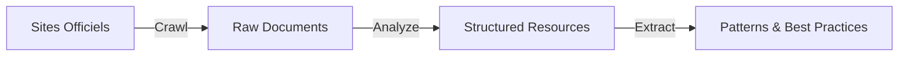
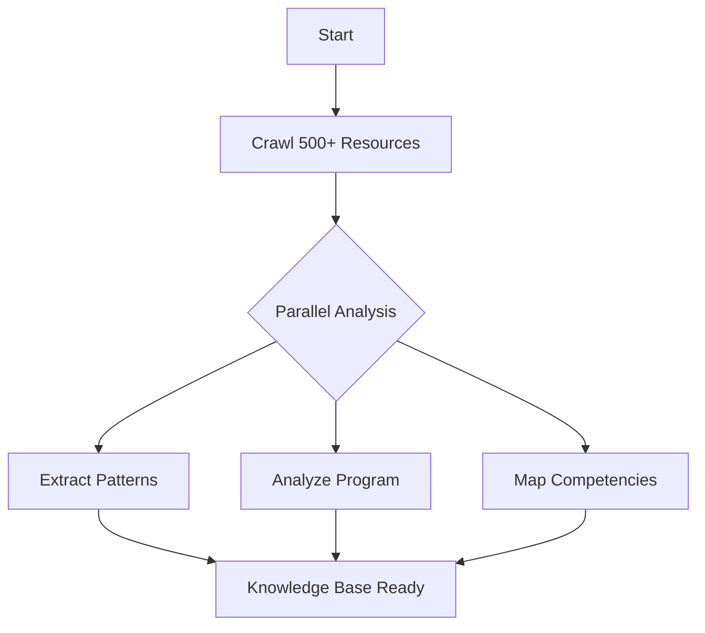
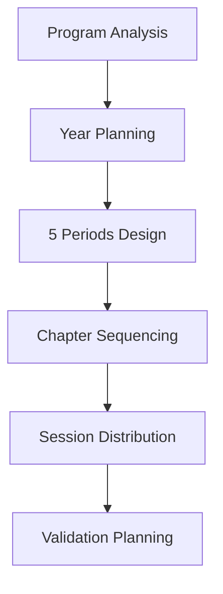
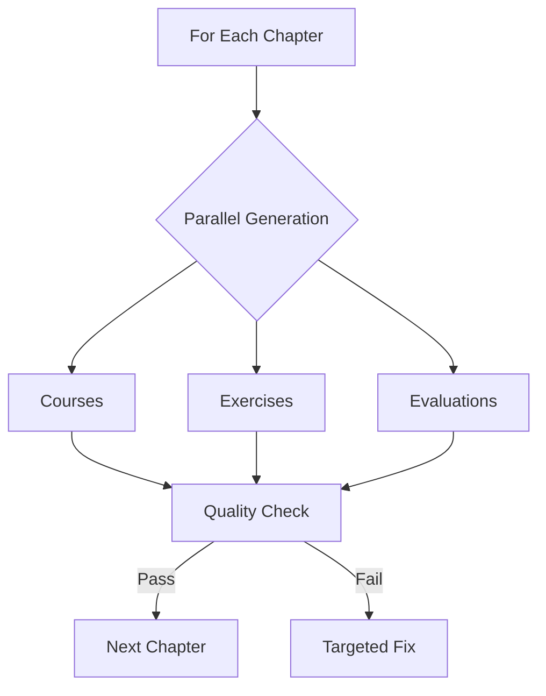
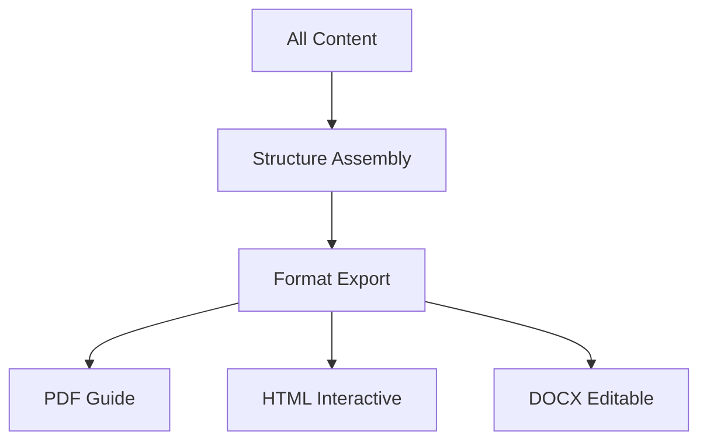

# 🎯 TODO ROADMAP DÉTAILLÉ - Architecture Math Content Generator

## 📋 Vue d'Ensemble du Projet

### Objectif Principal
Générer automatiquement une année complète de contenu pédagogique en mathématiques :
- **140 sessions complètes** avec timing minute par minute
- **1000+ exercices progressifs** avec corrections détaillées
- **40+ évaluations** avec barèmes et grilles de compétences
- **Guides pédagogiques** pour chaque notion
- **Temps total** : < 4 heures
- **Coût total** : < 50€
- **Intervention humaine** : Input initial uniquement

### Innovation Clé : Architecture Multi-Domaines
Les chapitres mathématiques sont rarement mono-domaine. Notre architecture reflète cette réalité :
- Chapitres avec pondérations multi-domaines
- Exercices transversaux
- Évaluations intégrées
- Progression spiralaire

---

## 🏗️ Architecture Technique Détaillée

### 1. MODULE : ResourceDiscoveryEngine
**Responsabilité** : Crawler et analyser les ressources pédagogiques officielles

#### Composants
```python
class ResourceDiscoveryEngine:
    def __init__(self):
        self.crawler = EducationalCrawler()
        self.analyzer = DocumentAnalyzer()
        self.quality_filter = QualityFilter()
        self.cache = ResourceCache()
```

#### Méthodes Principales
1. **crawl_official_sources()**
   - Input : URLs des sites officiels (education.gouv.fr, eduscol, académies)
   - Process : Crawling parallèle avec Scrapy/BeautifulSoup
   - Output : `List[RawResource]` avec métadonnées
   - Performance : 500+ documents en 30 min

2. **analyze_pedagogical_document()**
   - Input : `RawResource`
   - Process : Analyse approfondie via Claude (prompt enrichi ~1500 tokens)
   - Output : `AnalyzedResource` avec extraction complète
   - Parallélisation : 10 documents simultanés

3. **extract_pedagogical_patterns()**
   - Input : `List[AnalyzedResource]`
   - Process : Identification patterns via ML
   - Output : `PedagogicalPatterns` réutilisables

#### Workflow


---

### 2. MODULE : ProgramAnalyzer
**Responsabilité** : Analyser et structurer le programme officiel

#### Composants
```python
class ProgramAnalyzer:
    def __init__(self):
        self.parser = OfficialProgramParser()
        self.didactic_analyzer = DidacticAnalyzer()
        self.competency_mapper = CompetencyMapper()
        self.progression_builder = ProgressionBuilder()
```

#### Méthodes Principales
1. **parse_official_program()**
   - Input : Programme officiel PDF/HTML
   - Process : Extraction structurée via NLP + Claude
   - Output : `OfficialProgram` avec hiérarchie complète
   - Enrichissement : Analyse didactique intégrée

2. **analyze_learning_obstacles()**
   - Input : `Concept` + niveau
   - Process : Analyse approfondie obstacles (prompt ~2000 tokens)
   - Output : `DidacticAnalysis` avec stratégies
   - Base : Recherches didactiques + retours terrain

3. **map_competencies()**
   - Input : `Chapter` + activités
   - Process : Mapping 6 compétences mathématiques
   - Output : `CompetencyMatrix` pondérée

4. **identify_transversal_chapters()**
   - Input : `List[Chapter]`
   - Process : Analyse croisements domaines
   - Output : `Dict[Chapter, DomainWeights]`

---

### 3. MODULE : YearPlanningOrchestrator
**Responsabilité** : Orchestrer la planification annuelle optimale

#### Composants
```python
class YearPlanningOrchestrator:
    def __init__(self):
        self.calendar_manager = SchoolCalendarManager()
        self.progression_optimizer = ProgressionOptimizer()
        self.constraint_solver = ConstraintSolver()
        self.balance_checker = DomainBalanceChecker()
```

#### Méthodes Principales
1. **create_year_planning()**
   - Input : `OfficialProgram` + contraintes
   - Process : Optimisation multi-contraintes (prompt stratégique ~2500 tokens)
   - Output : `YearPlanning` avec 5 périodes équilibrées
   - Algorithme : Satisfaction contraintes + heuristiques pédagogiques

2. **design_chapter_sequence()**
   - Input : `Chapter` + contexte annuel
   - Process : Conception séquence pédagogique (prompt ~3000 tokens)
   - Output : `ChapterSequence` avec phases détaillées
   - Innovation : Gestion native multi-domaines

3. **optimize_spiral_progression()**
   - Input : `YearPlanning` draft
   - Process : Optimisation revisites notions
   - Output : `OptimizedPlanning` avec spirales

---

### 4. MODULE : ContentGenerationEngine
**Responsabilité** : Générer tout le contenu pédagogique

#### Composants
```python
class ContentGenerationEngine:
    def __init__(self):
        self.course_generator = CourseContentGenerator()
        self.exercise_generator = ExerciseGenerator()
        self.evaluation_generator = EvaluationGenerator()
        self.differentiation_engine = DifferentiationEngine()
        self.parallel_processor = ParallelClaudeProcessor(max_concurrent=10)
```

#### Méthodes Principales
1. **generate_session_content()**
   - Input : `Session` + contexte pédagogique complet
   - Process : Génération via prompts enrichis (~1500 tokens in, ~1200 out)
   - Output : `SessionContent` complet avec timing
   - Parallélisation : 10 sessions simultanées

2. **generate_differentiated_exercises()**
   - Input : `ExerciseSpec` + profils élèves
   - Process : Génération 3 parcours (prompt ~1000 tokens)
   - Output : `DifferentiatedExerciseSet`
   - Volume : 20-30 exercices/session

3. **generate_evaluation()**
   - Input : `EvaluationSpec` + chapitres
   - Process : Génération complète (prompt ~2000 tokens)
   - Output : `Evaluation` avec barème + grilles
   - Qualité : Validation automatique intégrée

#### Stratégie de Parallélisation
```python
async def generate_chapter_content(chapter: Chapter):
    # Phase 1 : Analyse approfondie
    analysis = await deep_analyze_chapter(chapter)  # 1 appel riche
    
    # Phase 2 : Génération parallèle
    tasks = []
    for session in chapter.sessions:
        task = generate_with_context(session, analysis)
        tasks.append(task)
    
    # Exécution : 10 sessions en parallèle
    results = await asyncio.gather(*tasks)
    return assemble_chapter(results)
```

---

### 5. MODULE : QualityAssuranceSystem
**Responsabilité** : Garantir la qualité pédagogique et la conformité

#### Composants
```python
class QualityAssuranceSystem:
    def __init__(self):
        self.pedagogical_validator = PedagogicalValidator()
        self.conformity_checker = ConformityChecker()
        self.coherence_analyzer = CoherenceAnalyzer()
        self.improvement_engine = ImprovementEngine()
```

#### Méthodes Principales
1. **validate_pedagogical_quality()**
   - Input : Contenu généré
   - Process : Validation multi-critères (prompt ~2000 tokens)
   - Output : `QualityReport` avec score et corrections
   - Seuil : 95%+ requis

2. **check_multi_domain_balance()**
   - Input : `Chapter` ou `YearPlanning`
   - Process : Vérification équilibres domaines
   - Output : `BalanceReport` avec ajustements

3. **recursive_improvement()**
   - Input : Contenu + `QualityReport`
   - Process : Amélioration ciblée
   - Output : Contenu amélioré
   - Limite : 3 itérations max

---

### 6. MODULE : OutputAssembler
**Responsabilité** : Assembler et formater les livrables finaux

#### Composants
```python
class OutputAssembler:
    def __init__(self):
        self.formatter = MultiFormatExporter()
        self.packager = ContentPackager()
        self.metadata_generator = MetadataGenerator()
```

#### Méthodes Principales
1. **assemble_teacher_guide()**
   - Input : Tout le contenu généré
   - Process : Assemblage structuré
   - Output : Guide PDF/HTML interactif
   - Sections : Planning, séances, exercices, évaluations

2. **export_multi_format()**
   - Formats : PDF, HTML, DOCX, LaTeX
   - Adaptation : Selon usage (impression, projection, LMS)
   - Métadonnées : Complètes pour indexation

---

## 📊 Estimations de Performance (Nouvelle Stratégie)

### Métriques Clés
| Métrique | Valeur | Justification |
|----------|--------|---------------|
| **Temps total génération** | 3h45 | Parallélisation massive |
| **Nombre appels Claude** | ~525 | Incluant 5% régénération |
| **Tokens moyens/appel** | In: 1500, Out: 1000 | Prompts enrichis |
| **Coût total** | 45-50€ | Optimisation in/out |
| **Qualité pédagogique** | 95%+ | Contexte riche |
| **Taux de succès** | 95% | Moins de régénération |

### Optimisation Coût (Nouvelle Approche)
```yaml
Stratégie Prompts Enrichis:
  Principe: "Investir dans la qualité des prompts d'entrée"
  Ratio_cout: "Sortie 5x plus chère que l'entrée"
  
  Avantages:
    - Qualité_premiere_generation: 95%+ (vs 70%)
    - Regenerations: <5% (vs 20%)
    - Contexte_pedagogique: Complet
    - Flexibilite: Maximale
    
  Implementation:
    - Prompts_entree: ~1500 tokens (contexte riche)
    - Prompts_sortie: ~1000 tokens (structuré)
    - Cout_moyen_appel: $0.020
    - ROI: Excellent (moins d'itérations)
```

### Parallélisation Avancée
```python
# Configuration optimale
PARALLEL_CONFIG = {
    "max_concurrent_calls": 10,
    "batch_size": 10,
    "retry_strategy": "exponential_backoff",
    "quality_threshold": 0.95,
    "timeout_seconds": 60
}

# Stratégie par phase
GENERATION_PHASES = {
    "analysis": {"concurrent": 5, "priority": "high"},
    "content": {"concurrent": 10, "priority": "normal"},
    "validation": {"concurrent": 5, "priority": "high"}
}
```

---

## 🔄 Workflow Global Détaillé

### Phase 1 : Discovery & Analysis (45 min)


### Phase 2 : Planning (20 min)


### Phase 3 : Generation (150 min)


### Phase 4 : Assembly (30 min)


---

## 🚧 Points d'Attention Critiques

### 1. Gestion de la Complexité Multi-Domaines
- **Défi** : Éviter la confusion entre domaines
- **Solution** : Prompts explicites sur les connexions
- **Validation** : Vérification cohérence transversale

### 2. Qualité Pédagogique Constante
- **Défi** : Maintenir l'excellence sur 140 sessions
- **Solution** : Templates validés + contexte riche
- **Monitoring** : Scores qualité en temps réel

### 3. Performance et Coûts
- **Défi** : Rester sous 50€
- **Solution** : Optimisation in/out + parallélisation
- **Tracking** : Dashboard coûts temps réel

### 4. Adaptabilité aux Contextes
- **Défi** : Différents profils classes/établissements
- **Solution** : Paramètres configurables
- **Flexibilité** : Génération adaptative

---

## ✅ Critères de Succès

### Quantitatifs
- ✓ Temps génération < 4h
- ✓ Coût < 50€
- ✓ 140 sessions complètes
- ✓ 1000+ exercices
- ✓ 40+ évaluations

### Qualitatifs
- ✓ Conformité programme 100%
- ✓ Qualité pédagogique > 95%
- ✓ Utilisabilité immédiate
- ✓ Différenciation intégrée
- ✓ Multi-domaines cohérent

---

## 🎯 Prochaines Étapes

1. **Validation POC** : 1 chapitre complet
2. **Optimisation** : Ajustement prompts
3. **Scaling** : Infrastructure production
4. **Beta Test** : 10 enseignants pilotes
5. **Production** : Lancement SaaS

---

*Document vivant - Dernière mise à jour : Intégration stratégie prompts enrichis*