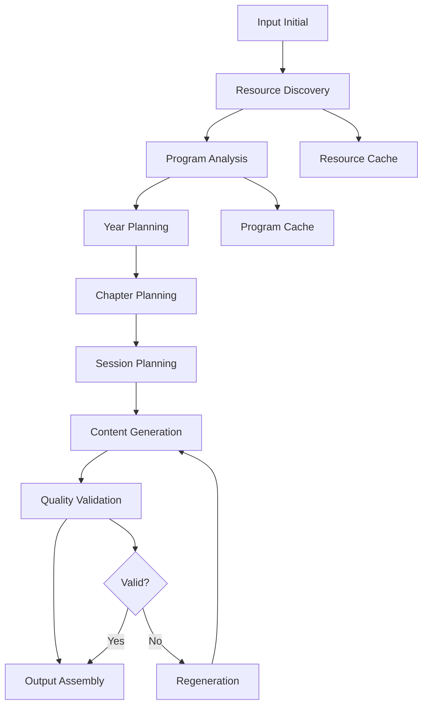

# 🎯 ROADMAP DÉTAILLÉ - Math Content Generator
## Système de Génération Complète de Contenus Pédagogiques Mathématiques

### 📌 OBJECTIF PRINCIPAL
**Produire automatiquement l'intégralité des contenus pédagogiques d'une année scolaire pour un professeur de mathématiques**, incluant :
- Planning détaillé de chaque séance (120-140 séances/an)
- Contenu de cours complet pour chaque notion
- Exercices d'entraînement progressifs
- Évaluations formatives et sommatives
- Corrections détaillées
- Guides pédagogiques pour l'enseignant

**Contraintes :**
- Intervention humaine minimale (input initial uniquement)
- Appels API Claude optimisés (parallèles, récursifs, concis)
- Fiabilité et exhaustivité garanties
- Conformité totale aux programmes officiels

---

## 🏗️ ARCHITECTURE GLOBALE DU SYSTÈME

### Workflow Principal de Génération



### Pipeline de Traitement Parallèle

```python
# Architecture pour appels API parallèles et récursifs
class GenerationPipeline:
    """
    Pipeline principal orchestrant tous les appels Claude
    avec parallélisation maximale et récursivité adaptative
    """
    
    def __init__(self):
        self.max_parallel_calls = 10
        self.recursion_depth = 5
        self.quality_threshold = 0.95
```

---

## 📦 MODULE 1: ResourceDiscoveryEngine
**Objectif**: Découvrir et indexer automatiquement TOUTES les ressources pédagogiques pertinentes

### 1.1 WebCrawler

```python
class WebCrawler:
    """Crawling intelligent des sources éducatives officielles"""
    
    async def crawl_all_sources(self, level: str, subject: str = "maths") -> CrawlResults:
        """
        Entrées:
            - level: str (ex: "5ème", "4ème")
            - subject: str = "maths"
        
        Sorties:
            - CrawlResults: {
                "eduscol": List[Resource],
                "bo": List[OfficialText],
                "irem": List[Research],
                "academies": List[LocalResource],
                "textbooks": List[TextbookResource],
                "research_papers": List[Paper]
              }
        
        Dépendances:
            - aiohttp pour requêtes asynchrones
            - BeautifulSoup pour parsing HTML
            - Selenium pour sites JavaScript
        """
        
    async def crawl_eduscol(self, level: str) -> List[EduscolResource]:
        """
        Processus:
            1. Naviguer vers la page du niveau
            2. Extraire tous les liens de ressources
            3. Télécharger chaque ressource (PDF, DOCX)
            4. Parser et indexer le contenu
        """
        
    async def crawl_official_bulletin(self, year_range: tuple) -> List[OfficialProgram]:
        """
        Processus:
            1. Rechercher tous les BO des 5 dernières années
            2. Filtrer par niveau et matière
            3. Extraire programmes et circulaires
            4. Structurer par compétences attendues
        """
```

### 1.2 DocumentParser

```python
class DocumentParser:
    """Extraction intelligente du contenu des documents"""
    
    def parse_pdf(self, pdf_path: Path) -> ParsedDocument:
        """
        Entrées:
            - pdf_path: Path du fichier PDF
        
        Sorties:
            - ParsedDocument: {
                "title": str,
                "type": DocumentType,
                "content": {
                    "chapters": List[Chapter],
                    "competencies": List[Competency],
                    "exercises": List[Exercise],
                    "methodology": List[Method]
                },
                "metadata": {
                    "source": str,
                    "date": datetime,
                    "official_level": bool
                }
              }
        """
        
    def extract_pedagogical_elements(self, text: str) -> PedagogicalElements:
        """
        Utilise NLP pour extraire:
            - Objectifs pédagogiques
            - Prérequis
            - Difficultés connues
            - Progressions suggérées
            - Méthodes recommandées
        """
```

### 1.3 ResourceIndexer

```python
class ResourceIndexer:
    """Indexation et recherche rapide des ressources"""
    
    async def build_index(self, resources: List[Resource]) -> SearchIndex:
        """
        Entrées:
            - resources: Liste de toutes les ressources crawlées
        
        Sorties:
            - SearchIndex: Index permettant recherche par:
                * Niveau
                * Chapitre/Notion
                * Type (cours, exercices, évaluation)
                * Compétence
                * Difficulté
                * Source
        
        Technologies:
            - Elasticsearch ou Whoosh pour indexation
            - Embeddings pour recherche sémantique
        """
        
    def search(self, query: SearchQuery) -> List[RankedResource]:
        """
        Recherche multi-critères avec ranking par pertinence
        """
```

---

## 📊 MODULE 2: ProgramAnalyzer
**Objectif**: Analyser en profondeur le programme officiel et créer une structure pédagogique complète

### 2.1 OfficialProgramParser

```python
class OfficialProgramParser:
    """Analyse détaillée du programme officiel"""
    
    async def analyze_program(self, level: str, resources: List[Resource]) -> ProgramStructure:
        """
        Entrées:
            - level: str
            - resources: Ressources officielles (BO, Eduscol)
        
        Sorties:
            - ProgramStructure: {
                "competencies": {
                    "chercher": List[SubCompetency],
                    "modeliser": List[SubCompetency],
                    "representer": List[SubCompetency],
                    "raisonner": List[SubCompetency],
                    "calculer": List[SubCompetency],
                    "communiquer": List[SubCompetency]
                },
                "domains": {
                    "nombres_calculs": Domain,
                    "organisation_donnees": Domain,
                    "grandeurs_mesures": Domain,
                    "espace_geometrie": Domain,
                    "algorithmique": Domain
                },
                "annual_objectives": List[Objective],
                "evaluation_criteria": List[Criterion]
              }
        
        Processus:
            1. Parser tous les documents officiels
            2. Extraire la structure hiérarchique
            3. Identifier les liens entre notions
            4. Mapper compétences <-> contenus
        """
        
    async def extract_learning_progressions(self, program: ProgramStructure) -> LearningPath:
        """
        Construit les chemins d'apprentissage optimaux
        en analysant les prérequis et dépendances
        """
```

### 2.2 DidacticAnalyzer

```python
class DidacticAnalyzer:
    """Analyse didactique basée sur la recherche"""
    
    async def analyze_didactic_obstacles(self, concept: Concept) -> DidacticAnalysis:
        """
        Entrées:
            - concept: Notion mathématique à analyser
        
        Sorties:
            - DidacticAnalysis: {
                "known_obstacles": List[Obstacle],
                "common_errors": List[Error],
                "misconceptions": List[Misconception],
                "remediation_strategies": List[Strategy],
                "research_references": List[Reference]
              }
        
        Appels Claude:
            - Analyse des obstacles épistémologiques
            - Synthèse de la recherche didactique
            - Stratégies de remédiation
        """
        
    async def get_teaching_recommendations(self, topic: str) -> TeachingGuide:
        """
        Génère un guide pédagogique basé sur:
            - Recherche IREM
            - Publications didactiques
            - Retours d'expérience terrain
        """
```

---

## 📅 MODULE 3: YearPlanningOrchestrator
**Objectif**: Créer une planification annuelle détaillée et optimisée

### 3.1 AnnualScheduler

```python
class AnnualScheduler:
    """Planification optimale de l'année scolaire"""
    
    async def create_year_planning(
        self,
        program: ProgramStructure,
        constraints: YearConstraints
    ) -> DetailedYearPlanning:
        """
        Entrées:
            - program: Structure complète du programme
            - constraints: {
                "total_sessions": int (120-140),
                "holidays": List[DateRange],
                "evaluation_periods": List[Period],
                "school_specifics": Dict
              }
        
        Sorties:
            - DetailedYearPlanning: {
                "periods": List[Period], # 5 périodes
                "chapters": List[ChapterPlanning],
                "sessions": List[SessionPlanning], # 120-140 sessions
                "evaluations": List[EvaluationPlanning],
                "remediations": List[RemediationSlot],
                "buffer_time": List[BufferSession]
              }
        
        Algorithme:
            1. Découper l'année en périodes
            2. Répartir les chapitres par période
            3. Allouer les séances par chapitre
            4. Placer les évaluations
            5. Prévoir temps de remédiation
            6. Optimiser la progression
        """
        
    def optimize_learning_flow(self, planning: YearPlanning) -> OptimizedPlanning:
        """
        Optimise la progression pour:
            - Respecter les prérequis
            - Équilibrer la charge cognitive
            - Alterner les domaines
            - Spiraler les apprentissages
        """
```

### 3.2 ChapterPlanner

```python
class ChapterPlanner:
    """Planification détaillée de chaque chapitre"""
    
    async def plan_chapter(
        self,
        chapter_topic: str,
        allocated_sessions: int,
        program_requirements: Requirements
    ) -> DetailedChapterPlan:
        """
        Entrées:
            - chapter_topic: str (ex: "Fractions")
            - allocated_sessions: int (ex: 12)
            - program_requirements: Exigences officielles
        
        Sorties:
            - DetailedChapterPlan: {
                "metadata": {
                    "title": str,
                    "duration": int,
                    "objectives": List[LearningObjective],
                    "competencies": List[Competency],
                    "prerequisites": List[Prerequisite]
                },
                "sessions": List[SessionPlan],
                "activities": {
                    "discovery": List[Activity],
                    "practice": List[Exercise],
                    "deepening": List[Problem],
                    "evaluation": List[Assessment]
                },
                "differentiation": {
                    "remediation": List[RemediationActivity],
                    "enrichment": List[EnrichmentActivity]
                },
                "resources": List[Resource]
              }
        
        Appels Claude parallèles:
            - Génération structure du chapitre
            - Création des objectifs détaillés
            - Design des activités
            - Planification de la progression
        """
```

### 3.3 SessionDesigner

```python
class SessionDesigner:
    """Conception détaillée de chaque séance"""
    
    async def design_session(
        self,
        session_number: int,
        chapter_context: ChapterContext,
        session_type: SessionType
    ) -> DetailedSession:
        """
        Entrées:
            - session_number: int (1-140)
            - chapter_context: Contexte du chapitre
            - session_type: DISCOVERY | PRACTICE | EVALUATION | REMEDIATION
        
        Sorties:
            - DetailedSession: {
                "metadata": {
                    "number": int,
                    "duration": 55, # minutes
                    "date_slot": DateSlot,
                    "objectives": List[SessionObjective]
                },
                "timeline": [
                    {"0-5min": "Accueil et rappels"},
                    {"5-10min": "Correction devoirs"},
                    {"10-25min": "Activité principale"},
                    {"25-40min": "Exercices guidés"},
                    {"40-50min": "Pratique autonome"},
                    {"50-55min": "Bilan et devoirs"}
                ],
                "content": {
                    "warm_up": Activity,
                    "main_activity": DetailedActivity,
                    "exercises": List[Exercise],
                    "homework": Homework
                },
                "teacher_guide": {
                    "key_points": List[str],
                    "common_errors": List[str],
                    "differentiation": Dict,
                    "board_plan": BoardLayout
                },
                "materials": List[Material]
              }
        """
```

---

## 🎨 MODULE 4: ContentGenerationEngine
**Objectif**: Générer tout le contenu pédagogique avec appels Claude optimisés

### 4.1 ParallelContentGenerator

```python
class ParallelContentGenerator:
    """Génération massivement parallèle du contenu"""
    
    async def generate_all_content(
        self,
        year_planning: DetailedYearPlanning
    ) -> CompleteYearContent:
        """
        Entrées:
            - year_planning: Planning annuel complet
        
        Sorties:
            - CompleteYearContent: {
                "courses": Dict[ChapterId, CourseContent],
                "exercises": Dict[ChapterId, ExerciseSet],
                "evaluations": Dict[ChapterId, EvaluationSet],
                "corrections": Dict[ContentId, Correction],
                "teacher_guides": Dict[SessionId, TeacherGuide]
              }
        
        Stratégie de parallélisation:
            1. Batch par type de contenu
            2. 10 appels Claude simultanés max
            3. Retry automatique si échec
            4. Cache intelligent des résultats
        """
        
    async def generate_course_content(
        self,
        chapter: ChapterPlan,
        style_guide: StyleGuide
    ) -> CourseContent:
        """
        Génère le cours complet avec:
            - Introduction motivante
            - Développement progressif
            - Exemples travaillés
            - Synthèse et méthodes
            - Exercices d'application
        """
```

### 4.2 ExerciseGenerator

```python
class ExerciseGenerator:
    """Génération d'exercices progressifs et variés"""
    
    async def generate_exercise_set(
        self,
        topic: str,
        levels: List[DifficultyLevel],
        quantity: Dict[DifficultyLevel, int]
    ) -> ExerciseSet:
        """
        Entrées:
            - topic: str
            - levels: [BASIC, INTERMEDIATE, ADVANCED, EXPERT]
            - quantity: {"BASIC": 20, "INTERMEDIATE": 15, ...}
        
        Sorties:
            - ExerciseSet: {
                "training": {
                    "basic": List[Exercise],
                    "intermediate": List[Exercise],
                    "advanced": List[Exercise]
                },
                "problem_solving": List[Problem],
                "mental_math": List[QuickExercise],
                "homework": List[HomeworkExercise],
                "differentiation": {
                    "remediation": List[Exercise],
                    "enrichment": List[Challenge]
                }
              }
        
        Appels Claude récursifs:
            - Si qualité < seuil -> régénération
            - Si variété insuffisante -> nouveaux exemples
            - Si progression non fluide -> ajustements
        """
        
    def ensure_progression(self, exercises: List[Exercise]) -> List[Exercise]:
        """
        Vérifie et ajuste la progression des exercices
        """
```

### 4.3 EvaluationCreator

```python
class EvaluationCreator:
    """Création d'évaluations complètes"""
    
    async def create_evaluation_set(
        self,
        chapter: str,
        competencies: List[Competency]
    ) -> EvaluationSet:
        """
        Entrées:
            - chapter: str
            - competencies: Compétences à évaluer
        
        Sorties:
            - EvaluationSet: {
                "formative": [
                    {
                        "type": "diagnostic",
                        "content": Evaluation,
                        "timing": "start"
                    },
                    {
                        "type": "progress_check",
                        "content": Evaluation,
                        "timing": "middle"
                    }
                ],
                "summative": {
                    "main_evaluation": Evaluation,
                    "makeup_evaluation": Evaluation,
                    "differentiated": {
                        "adapted": Evaluation,
                        "extended": Evaluation
                    }
                },
                "grading_rubrics": Dict[EvalId, Rubric],
                "answer_keys": Dict[EvalId, AnswerKey]
              }
        """
```

### 4.4 CorrectionGenerator

```python
class CorrectionGenerator:
    """Génération de corrections détaillées"""
    
    async def generate_corrections(
        self,
        content: Content,
        pedagogy_style: PedagogyStyle
    ) -> DetailedCorrection:
        """
        Entrées:
            - content: Exercice ou évaluation
            - pedagogy_style: Style pédagogique souhaité
        
        Sorties:
            - DetailedCorrection: {
                "step_by_step": List[Step],
                "key_points": List[str],
                "common_errors": List[ErrorExplanation],
                "alternative_methods": List[Method],
                "going_further": List[Extension]
              }
        """
```

---

## ✅ MODULE 5: QualityAssuranceSystem
**Objectif**: Validation exhaustive et amélioration continue

### 5.1 ContentValidator

```python
class ContentValidator:
    """Validation multi-critères du contenu"""
    
    async def validate_content(
        self,
        content: GeneratedContent,
        criteria: ValidationCriteria
    ) -> ValidationReport:
        """
        Entrées:
            - content: Contenu généré
            - criteria: {
                "academic_compliance": 0.95,
                "pedagogical_quality": 0.90,
                "difficulty_progression": 0.85,
                "completeness": 1.0
              }
        
        Sorties:
            - ValidationReport: {
                "score": float,
                "passed": bool,
                "issues": List[Issue],
                "suggestions": List[Improvement],
                "regeneration_needed": List[ContentId]
              }
        
        Validations effectuées:
            1. Conformité programme officiel
            2. Cohérence pédagogique
            3. Progression des difficultés
            4. Exhaustivité du contenu
            5. Qualité rédactionnelle
            6. Exactitude mathématique
        """
```

### 5.2 RecursiveImprover

```python
class RecursiveImprover:
    """Amélioration récursive jusqu'à qualité optimale"""
    
    async def improve_until_valid(
        self,
        content: Content,
        validation_report: ValidationReport,
        max_iterations: int = 5
    ) -> ImprovedContent:
        """
        Processus:
            1. Analyser les problèmes identifiés
            2. Générer prompts d'amélioration ciblés
            3. Appeler Claude pour corrections
            4. Re-valider
            5. Répéter jusqu'à validation ou max_iterations
        """
```

---

## 📤 MODULE 6: OutputAssembler
**Objectif**: Assembler et formater tous les livrables

### 6.1 DocumentAssembler

```python
class DocumentAssembler:
    """Assemblage des documents finaux"""
    
    async def assemble_year_package(
        self,
        content: CompleteYearContent,
        format_options: FormatOptions
    ) -> YearPackage:
        """
        Entrées:
            - content: Tout le contenu généré
            - format_options: {
                "formats": ["PDF", "DOCX", "HTML"],
                "style": "child_friendly",
                "include_solutions": bool,
                "teacher_edition": bool
              }
        
        Sorties:
            - YearPackage: {
                "teacher_handbook": {
                    "year_overview": Document,
                    "session_guides": List[Document],
                    "assessment_package": Document,
                    "differentiation_guide": Document
                },
                "student_materials": {
                    "textbook": Document,
                    "workbook": Document,
                    "homework_book": Document
                },
                "digital_resources": {
                    "interactive_exercises": List[Resource],
                    "videos": List[VideoLink],
                    "online_platform": PlatformAccess
                },
                "print_ready": {
                    "all_courses": List[PDF],
                    "all_exercises": List[PDF],
                    "all_evaluations": List[PDF]
                }
              }
        """
```

### 6.2 InteractivePackager

```python
class InteractivePackager:
    """Création de ressources interactives"""
    
    def create_digital_package(self, content: Content) -> DigitalPackage:
        """
        Génère:
            - Exercices interactifs (H5P)
            - Quiz auto-correctifs
            - Simulations GeoGebra
            - Vidéos explicatives
            - Parcours adaptatifs
        """
```

---

## 🔄 WORKFLOW D'EXÉCUTION COMPLÈTE

### Phase 1: Initialisation (5 minutes)
```python
async def phase_1_initialization(user_input: UserInput) -> InitialContext:
    """
    1. Parser input utilisateur (niveau, spécificités)
    2. Configurer paramètres de génération
    3. Initialiser caches et ressources
    4. Préparer infrastructure parallèle
    """
```

### Phase 2: Discovery & Analysis (30 minutes)
```python
async def phase_2_discovery(context: InitialContext) -> AnalysisResults:
    """
    Exécution parallèle:
    - Crawler toutes les sources officielles
    - Parser documents trouvés
    - Analyser programme officiel
    - Extraire contraintes didactiques
    - Indexer toutes les ressources
    """
```

### Phase 3: Planning (20 minutes)
```python
async def phase_3_planning(analysis: AnalysisResults) -> CompletePlanning:
    """
    Appels Claude parallèles pour:
    - Créer planning annuel
    - Détailler chaque période
    - Planifier chaque chapitre
    - Designer chaque séance
    - Optimiser progressions
    """
```

### Phase 4: Content Generation (2-3 heures)
```python
async def phase_4_generation(planning: CompletePlanning) -> GeneratedContent:
    """
    Génération massivement parallèle:
    - 10 workers Claude simultanés
    - Batch par type de contenu
    - Génération récursive si qualité insuffisante
    - Cache intelligent des résultats
    """
```

### Phase 5: Validation & Improvement (30 minutes)
```python
async def phase_5_validation(content: GeneratedContent) -> ValidatedContent:
    """
    Validation parallèle:
    - Conformité académique
    - Cohérence pédagogique
    - Exhaustivité
    - Amélioration récursive des problèmes
    """
```

### Phase 6: Assembly & Delivery (15 minutes)
```python
async def phase_6_assembly(content: ValidatedContent) -> FinalPackage:
    """
    - Compiler tous les documents
    - Générer formats multiples
    - Créer package enseignant
    - Préparer ressources élèves
    - Finaliser livraison
    """
```

---

## 🎯 MÉTRIQUES DE PERFORMANCE

### Temps Total de Génération
- **Objectif**: < 4 heures pour une année complète
- **Répartition**:
  - Discovery: 30 min
  - Planning: 20 min
  - Generation: 180 min
  - Validation: 30 min
  - Assembly: 15 min

### Volume de Contenu Généré
- **120-140 séances** complètes
- **10-12 chapitres** détaillés
- **1000+ exercices** progressifs
- **40+ évaluations** (formatives et sommatives)
- **500+ pages** de contenu pédagogique

### Qualité et Fiabilité
- **Conformité programme**: 100%
- **Score qualité pédagogique**: > 95%
- **Taux de régénération**: < 5%
- **Satisfaction enseignants cible**: > 90%

### Optimisation API Claude
- **Appels parallèles**: 10 simultanés
- **Tokens moyens/séance**: 2000
- **Cache hit rate**: > 60%
- **Coût total/année générée**: < 50€

---

## 🚀 IMPLÉMENTATION PRIORITAIRE

### Sprint 1 (2 semaines): Foundation
1. ResourceDiscoveryEngine core
2. ProgramAnalyzer base
3. Infrastructure parallélisation

### Sprint 2 (2 semaines): Planning
1. YearPlanningOrchestrator complet
2. Intégration Claude optimisée
3. Tests planning 5ème

### Sprint 3 (3 semaines): Generation
1. ContentGenerationEngine parallèle
2. Templates et styles
3. Génération récursive

### Sprint 4 (2 semaines): Quality
1. QualityAssuranceSystem
2. Amélioration récursive
3. Validation exhaustive

### Sprint 5 (1 semaine): Delivery
1. OutputAssembler
2. Formats multiples
3. Package final

---

## 📊 DÉPENDANCES TECHNIQUES DÉTAILLÉES

### Infrastructure
```yaml
compute:
  cpu: 8 cores minimum
  ram: 16 GB minimum
  storage: 100 GB SSD
  
api:
  claude_concurrent: 10
  rate_limiting: adaptive
  retry_strategy: exponential_backoff
  
database:
  type: PostgreSQL
  cache: Redis
  search: Elasticsearch
```

### Python Dependencies
```python
# Core
python = "^3.11"
asyncio = "*"
aiohttp = "^3.9"
httpx = "^0.25"

# AI/ML
anthropic = "^0.19"
langchain = "^0.1"
openai = "^1.12"  # embeddings
tiktoken = "^0.5"

# Web Scraping
beautifulsoup4 = "^4.12"
selenium = "^4.15"
playwright = "^1.40"
scrapy = "^2.11"

# Document Processing
pypdf2 = "^3.0"
python-docx = "^1.1"
pdfplumber = "^0.10"
pandas = "^2.1"

# NLP & Search
spacy = "^3.7"
nltk = "^3.8"
elasticsearch = "^8.11"
whoosh = "^2.7"

# Database
sqlalchemy = "^2.0"
asyncpg = "^0.29"
redis = "^5.0"

# Output Generation
jinja2 = "^3.1"
weasyprint = "^60"
reportlab = "^4.0"
python-pptx = "^0.6"

# Testing & Quality
pytest = "^7.4"
pytest-asyncio = "^0.21"
pytest-cov = "^4.1"
black = "^23.11"
ruff = "^0.1"

# Monitoring
sentry-sdk = "^1.38"
prometheus-client = "^0.19"
structlog = "^23.2"
```

---

## ✅ CRITÈRES DE SUCCÈS DÉTAILLÉS

### Fonctionnels
- [ ] Génération complète d'une année en < 4h
- [ ] 100% du programme officiel couvert
- [ ] Tous les types de contenus générés
- [ ] Qualité validée automatiquement
- [ ] Zéro intervention manuelle post-input

### Techniques
- [ ] 10 appels Claude parallèles stables
- [ ] Récursivité jusqu'à 5 niveaux
- [ ] Cache > 60% hit rate
- [ ] Pas de timeout sur génération complète
- [ ] Scalable à 100 utilisateurs simultanés

### Pédagogiques
- [ ] Conformité programmes validée
- [ ] Progression cohérente vérifiée
- [ ] Difficultés bien échelonnées
- [ ] Différenciation intégrée
- [ ] Corrections détaillées exhaustives

### Business
- [ ] Coût < 50€ par année générée
- [ ] Temps enseignant économisé > 200h/an
- [ ] Satisfaction utilisateur > 90%
- [ ] Taux d'adoption > 80%
- [ ] ROI positif dès 100 utilisateurs

---

Ce ROADMAP détaillé fournit une feuille de route complète pour atteindre l'objectif de génération automatique exhaustive d'une année complète de contenus pédagogiques mathématiques, avec une architecture robuste permettant des appels API massivement parallèles et une qualité garantie par validation récursive.