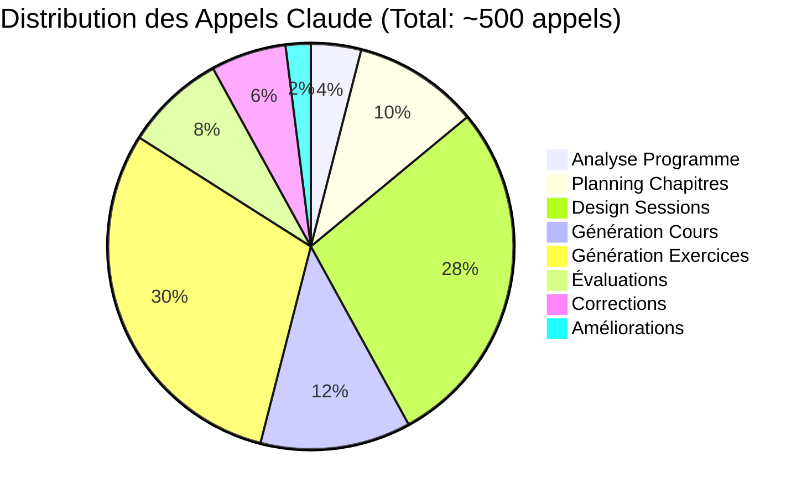

# 🔄 DIAGRAMME DE SÉQUENCE DÉTAILLÉ - Workflow Complet

## Vue d'Ensemble des Interactions

```mermaid
sequenceDiagram
    participant U as User
    participant M as MainOrchestrator
    participant RD as ResourceDiscovery
    participant PA as ProgramAnalyzer
    participant YP as YearPlanner
    participant CG as ContentGenerator
    participant QA as QualityAssurance
    participant OA as OutputAssembler
    participant C as Claude API
    participant DB as Database/Cache

    %% Phase 1: Initialisation
    U->>M: Demande génération (niveau, contraintes)
    M->>M: Valider input
    M->>DB: Initialiser caches
    M->>M: Configurer parallélisation (10 workers)
    
    %% Phase 2: Discovery
    M->>RD: Lancer discovery resources
    activate RD
    
    par Crawling parallèle
        RD->>RD: Crawler Eduscol
        and
        RD->>RD: Crawler BO
        and
        RD->>RD: Crawler IREM
        and
        RD->>RD: Crawler Académies
    end
    
    RD->>DB: Stocker ressources crawlées
    RD->>RD: Parser PDFs/Documents
    RD->>RD: Indexer contenu (Elasticsearch)
    RD-->>M: Resources indexées (>500 docs)
    deactivate RD
    
    %% Phase 3: Analysis
    M->>PA: Analyser programme officiel
    activate PA
    PA->>DB: Récupérer ressources BO
    
    par Analyse parallèle avec Claude
        PA->>C: Extraire structure programme
        and
        PA->>C: Identifier compétences
        and
        PA->>C: Analyser progressions
        and
        PA->>C: Détecter obstacles didactiques
    end
    
    PA->>PA: Construire graphe de dépendances
    PA->>DB: Sauvegarder analyse
    PA-->>M: ProgramStructure complète
    deactivate PA
    
    %% Phase 4: Planning
    M->>YP: Créer planning annuel
    activate YP
    YP->>YP: Calculer répartition temporelle
    
    par Planning parallèle (10 chapitres)
        YP->>C: Planifier chapitre 1
        and
        YP->>C: Planifier chapitre 2
        and
        YP->>C: ...
        and
        YP->>C: Planifier chapitre 10
    end
    
    YP->>YP: Optimiser progression globale
    
    loop Pour chaque chapitre (12)
        YP->>YP: Allouer sessions (8-15 par chapitre)
        
        par Sessions parallèles
            YP->>C: Designer session découverte
            and
            YP->>C: Designer sessions pratique
            and
            YP->>C: Designer évaluation
        end
    end
    
    YP->>DB: Sauvegarder planning (140 sessions)
    YP-->>M: DetailedYearPlanning
    deactivate YP
    
    %% Phase 5: Content Generation
    M->>CG: Générer tout le contenu
    activate CG
    
    Note over CG: Batch processing par type
    
    %% Génération des cours
    rect rgb(200, 220, 240)
        Note right of CG: Batch 1: Cours (12 chapitres)
        
        par Génération parallèle cours
            CG->>C: Générer cours ch1
            and
            CG->>C: Générer cours ch2
            and
            CG->>C: ...
            and
            CG->>C: Générer cours ch10
        end
        
        CG->>DB: Cache cours générés
    end
    
    %% Génération des exercices
    rect rgb(220, 240, 200)
        Note right of CG: Batch 2: Exercices (1000+)
        
        loop Pour chaque chapitre
            par Niveaux de difficulté
                CG->>C: Exercices basiques (20)
                and
                CG->>C: Exercices intermédiaires (15)
                and
                CG->>C: Exercices avancés (10)
                and
                CG->>C: Problèmes (5)
            end
        end
        
        CG->>CG: Vérifier progression
        CG->>DB: Cache exercices
    end
    
    %% Génération des évaluations
    rect rgb(240, 220, 200)
        Note right of CG: Batch 3: Évaluations (40+)
        
        par Types d'évaluation
            CG->>C: Évaluations diagnostiques
            and
            CG->>C: Évaluations formatives
            and
            CG->>C: Évaluations sommatives
        end
        
        CG->>C: Générer grilles correction
        CG->>DB: Cache évaluations
    end
    
    %% Génération des corrections
    rect rgb(240, 200, 220)
        Note right of CG: Batch 4: Corrections
        
        par Corrections parallèles
            CG->>C: Corrections exercices
            and
            CG->>C: Corrections évaluations
        end
        
        CG->>DB: Cache corrections
    end
    
    CG-->>M: CompleteYearContent
    deactivate CG
    
    %% Phase 6: Quality Assurance
    M->>QA: Valider tout le contenu
    activate QA
    
    par Validation parallèle
        QA->>QA: Conformité programme
        and
        QA->>QA: Cohérence pédagogique
        and
        QA->>QA: Progression difficultés
        and
        QA->>QA: Exhaustivité
    end
    
    QA->>QA: Calculer scores qualité
    
    alt Score < 0.95
        loop Amélioration récursive (max 5)
            QA->>C: Identifier améliorations
            QA->>CG: Régénérer contenu
            CG->>C: Appliquer corrections
            CG-->>QA: Contenu amélioré
            QA->>QA: Re-valider
        end
    end
    
    QA->>DB: Log validation
    QA-->>M: ValidatedContent
    deactivate QA
    
    %% Phase 7: Assembly
    M->>OA: Assembler livrables
    activate OA
    
    par Assembly parallèle
        OA->>OA: Générer PDFs cours
        and
        OA->>OA: Générer workbooks
        and
        OA->>OA: Créer guide enseignant
        and
        OA->>OA: Packager digital
    end
    
    OA->>OA: Créer archive complète
    OA-->>M: YearPackage final
    deactivate OA
    
    %% Livraison finale
    M->>DB: Archiver génération
    M->>U: Livrer package complet
    
    Note over U: 140 séances, 1000+ exercices, tout prêt à l'emploi!
```



## Détail des Appels Claude par Phase

### 📊 Répartition des Appels API



### 🔄 Stratégie de Parallélisation

```python
class ParallelizationStrategy:
    """
    Gestion optimale des appels parallèles Claude
    """
    
    def __init__(self):
        self.max_concurrent = 10
        self.rate_limit = 50  # calls/minute
        self.retry_strategy = ExponentialBackoff()
        
    async def execute_batch(self, tasks: List[Task]) -> List[Result]:
        """
        Exécute un batch de tâches en parallèle
        avec gestion des limites et retry
        """
        semaphore = asyncio.Semaphore(self.max_concurrent)
        
        async def process_with_limit(task):
            async with semaphore:
                return await self.execute_with_retry(task)
                
        results = await asyncio.gather(*[
            process_with_limit(task) for task in tasks
        ])
        
        return results
```

## 📈 Optimisation des Performances

### Mécanismes de Cache Multi-Niveaux

```python
class MultiLevelCache:
    """
    Cache intelligent pour minimiser les appels API
    """
    
    levels = {
        "L1": "Memory (hot cache)",      # < 1ms
        "L2": "Redis (warm cache)",      # < 10ms
        "L3": "PostgreSQL (cold cache)", # < 100ms
        "L4": "Claude API (miss)"        # 2-5s
    }
    
    async def get_or_generate(self, key: str, generator: Callable) -> Any:
        # Vérifier chaque niveau de cache
        for level in ["L1", "L2", "L3"]:
            if result := await self.check_cache(level, key):
                return result
        
        # Si miss, générer et propager dans tous les caches
        result = await generator()
        await self.propagate_to_caches(key, result)
        return result
```

### Pipeline de Traitement Asynchrone

```python
class AsyncPipeline:
    """
    Pipeline asynchrone pour traitement en flux
    """
    
    async def process_year_generation(self, config: Config):
        # Créer les queues de traitement
        discovery_queue = asyncio.Queue()
        analysis_queue = asyncio.Queue()
        planning_queue = asyncio.Queue()
        generation_queue = asyncio.Queue()
        
        # Lancer tous les workers en parallèle
        workers = [
            self.discovery_worker(discovery_queue, analysis_queue),
            self.analysis_worker(analysis_queue, planning_queue),
            self.planning_worker(planning_queue, generation_queue),
            self.generation_worker(generation_queue),
        ]
        
        # Traiter en pipeline continu
        await asyncio.gather(*workers)
```

## 🎯 Points de Contrôle et Métriques

### Checkpoints de Progression

```python
class ProgressTracker:
    """
    Suivi temps réel de la progression
    """
    
    checkpoints = [
        {"name": "Resources discovered", "target": 500, "weight": 0.1},
        {"name": "Program analyzed", "target": 1, "weight": 0.1},
        {"name": "Year planned", "target": 1, "weight": 0.1},
        {"name": "Chapters planned", "target": 12, "weight": 0.15},
        {"name": "Sessions designed", "target": 140, "weight": 0.2},
        {"name": "Content generated", "target": 1000, "weight": 0.25},
        {"name": "Quality validated", "target": 1, "weight": 0.1},
    ]
    
    def calculate_progress(self) -> float:
        """Calcule la progression globale pondérée"""
        total = sum(
            checkpoint["weight"] * (current / checkpoint["target"])
            for checkpoint in self.checkpoints
        )
        return min(total, 1.0)
```

### Métriques de Performance

```yaml
performance_metrics:
  latency:
    p50: 100ms  # Médiane
    p95: 500ms  # 95e percentile
    p99: 2s     # 99e percentile
  
  throughput:
    sessions_per_minute: 2
    exercises_per_minute: 10
    pages_per_hour: 150
  
  resource_usage:
    cpu_average: 60%
    memory_peak: 8GB
    api_calls_per_generation: 500
  
  quality:
    first_pass_success_rate: 95%
    average_regenerations: 0.05
    final_quality_score: 0.98
```

## 🔒 Gestion des Erreurs et Récupération

### Stratégie de Resilience

```python
class ResilienceManager:
    """
    Gestion robuste des erreurs et récupération
    """
    
    async def with_resilience(self, operation: Callable, context: Dict):
        strategies = [
            RetryStrategy(max_attempts=3, backoff=ExponentialBackoff()),
            CircuitBreakerStrategy(failure_threshold=5, reset_timeout=60),
            TimeoutStrategy(timeout=30),
            FallbackStrategy(fallback_operation=self.get_cached_or_simplified),
        ]
        
        for strategy in strategies:
            try:
                return await strategy.execute(operation, context)
            except RecoverableError:
                continue
                
        # Si toutes les stratégies échouent
        await self.save_partial_state(context)
        raise GenerationError("Unable to complete after all retry strategies")
```

## 📊 Dashboard de Monitoring Temps Réel

```typescript
interface GenerationDashboard {
  // Progression globale
  overall: {
    progress: number;        // 0-100%
    elapsed: string;        // "2h 15m"
    estimated: string;      // "1h 45m remaining"
    status: GenerationStatus;
  };
  
  // Détail par phase
  phases: {
    discovery: PhaseMetrics;
    analysis: PhaseMetrics;
    planning: PhaseMetrics;
    generation: PhaseMetrics;
    validation: PhaseMetrics;
    assembly: PhaseMetrics;
  };
  
  // Métriques API
  api: {
    calls_made: number;
    calls_remaining: number;
    error_rate: number;
    cache_hit_rate: number;
  };
  
  // Qualité temps réel
  quality: {
    current_score: number;
    issues_found: number;
    regenerations: number;
  };
}
```

Ce diagramme de séquence détaillé montre l'orchestration complète du système avec :
- **Parallélisation massive** à chaque étape
- **Pipeline asynchrone** pour performance optimale
- **Cache multi-niveaux** pour minimiser les coûts
- **Validation récursive** pour garantir la qualité
- **Monitoring temps réel** pour suivre la progression