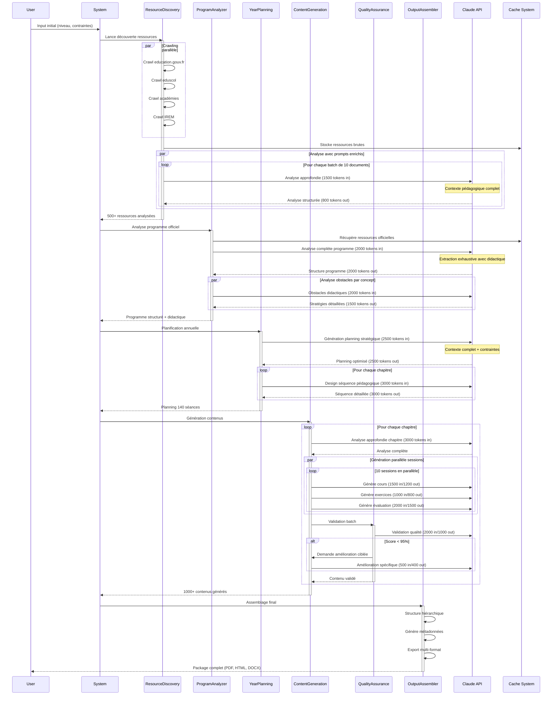
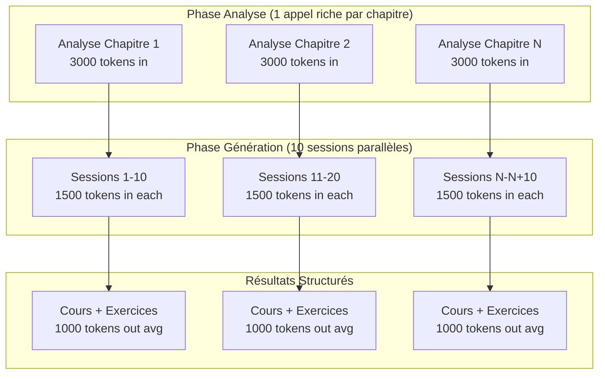
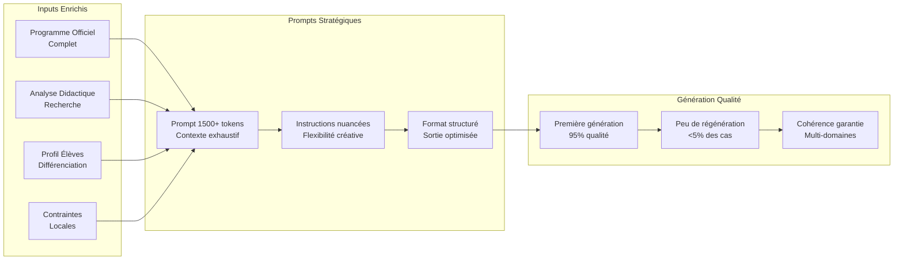
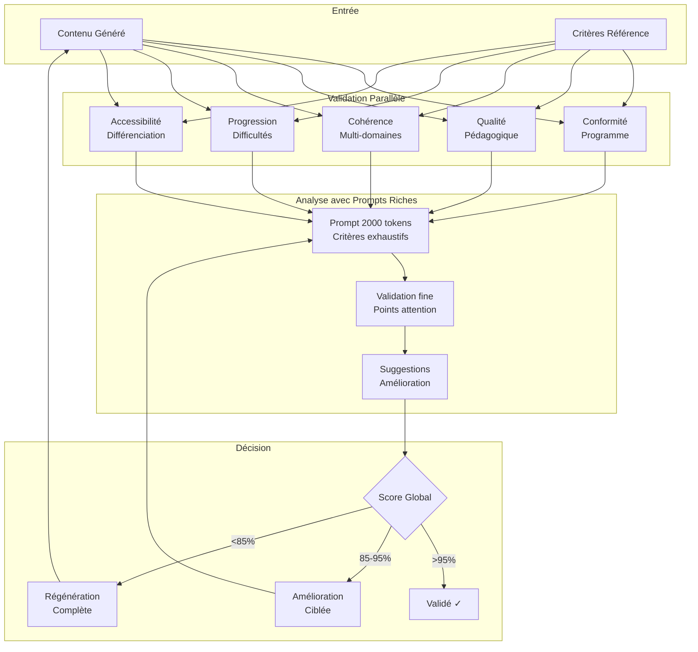
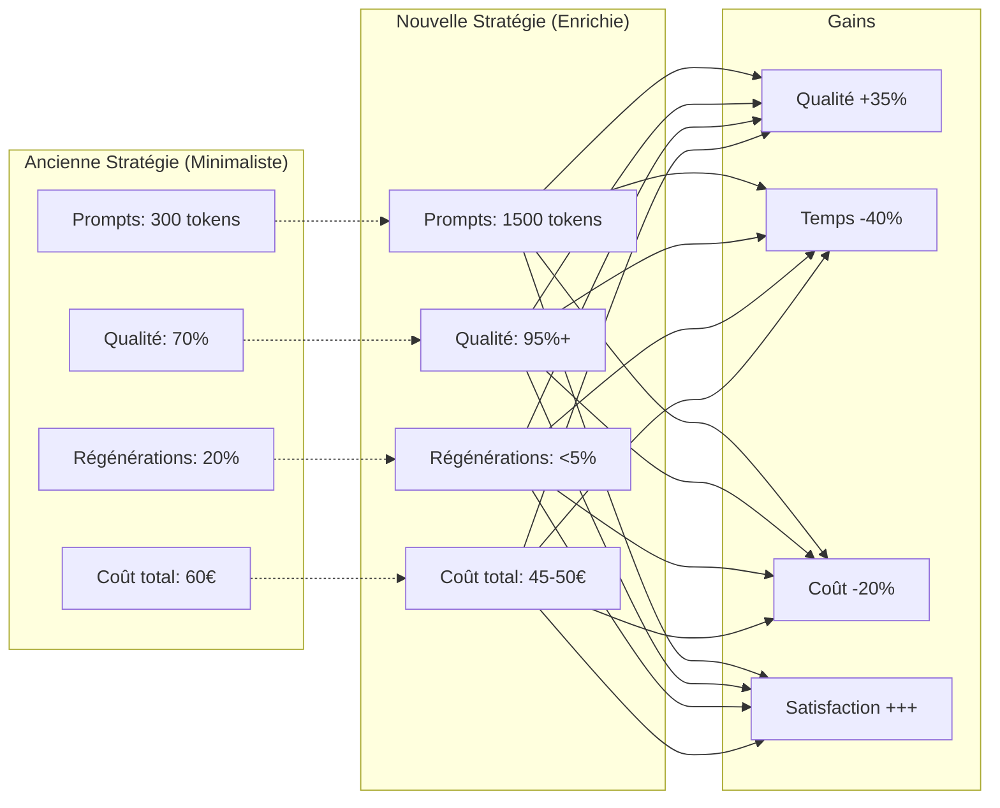
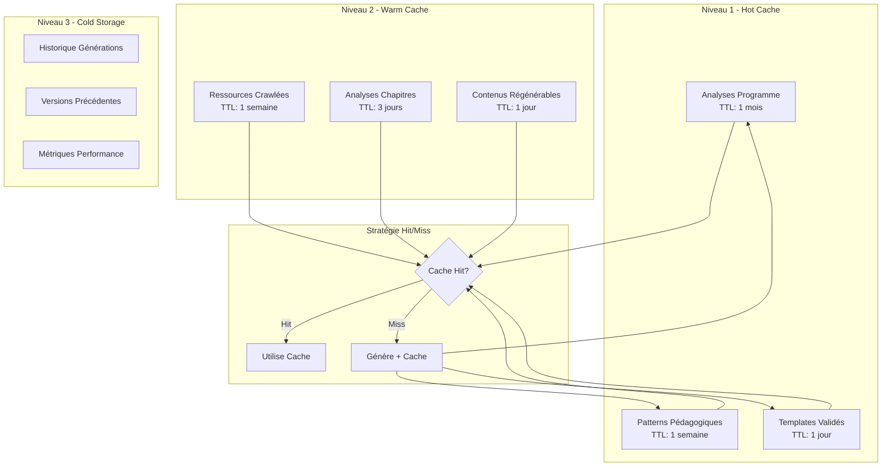
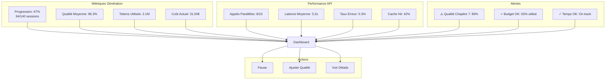

# 🔄 WORKFLOW & SEQUENCE DIAGRAMS - Math Content Generator

## 📊 Vue d'Ensemble du Workflow

### Principe Fondamental
Génération parallèle massive avec **prompts enrichis** pour maximiser la qualité dès la première génération.

### Métriques Clés (Nouvelle Stratégie)
- **Temps total** : < 4 heures
- **Coût total** : 45-50€
- **Appels Claude** : ~525 (incluant 5% régénération)
- **Qualité première génération** : 95%+
- **Parallélisation** : Jusqu'à 10 appels simultanés

---

## 🎭 Diagramme de Séquence Principal



---

## 🚀 Stratégie de Parallélisation Avancée

### Architecture des Appels Parallèles



### Optimisation des Batches

```python
# Configuration optimale pour la parallélisation
PARALLEL_STRATEGY = {
    "resource_analysis": {
        "batch_size": 10,
        "max_concurrent": 10,
        "tokens_in": 1500,
        "tokens_out": 800,
        "context": "full_pedagogical"
    },
    "content_generation": {
        "batch_size": 10,
        "max_concurrent": 10,
        "tokens_in": 1500,
        "tokens_out": 1200,
        "context": "chapter_analysis + session_specifics"
    },
    "quality_validation": {
        "batch_size": 5,
        "max_concurrent": 5,
        "tokens_in": 2000,
        "tokens_out": 1000,
        "context": "full_content + criteria"
    }
}
```

---

## 📈 Flux de Données Enrichi

### Nouvelle Approche : Contexte Riche



---

## 🎯 Diagramme d'État - Génération de Contenu

```mermaid
stateDiagram-v2
    [*] --> Initialisation
    
    Initialisation --> AnalyseRessources
    
    AnalyseRessources --> AnalyseProgramme
    note right of AnalyseRessources
        Prompts enrichis ~1500 tokens
        Analyse approfondie
        Extraction patterns
    end
    
    AnalyseProgramme --> PlanificationAnnuelle
    note right of AnalyseProgramme
        Contexte didactique complet
        Obstacles et remédiations
        Multi-domaines natif
    end
    
    PlanificationAnnuelle --> GénérationChapitre
    
    state GénérationChapitre {
        [*] --> AnalyseChapitre
        AnalyseChapitre --> GénérationParallèle
        
        state GénérationParallèle {
            [*] --> Cours
            [*] --> Exercices
            [*] --> Évaluations
            
            Cours --> Validation
            Exercices --> Validation
            Évaluations --> Validation
        }
        
        Validation --> QualitéOK: Score > 95%
        Validation --> Amélioration: Score < 95%
        
        Amélioration --> Validation
        QualitéOK --> [*]
    }
    
    GénérationChapitre --> ChapitresSuivants: Plus de chapitres
    GénérationChapitre --> Assemblage: Tous générés
    
    ChapitresSuivants --> GénérationChapitre
    
    Assemblage --> Export
    Export --> [*]
```

---

## 🔄 Pipeline de Validation Qualité

### Workflow de Validation Multi-Critères



---

## 💰 Analyse Coût-Performance

### Comparaison Ancienne vs Nouvelle Stratégie



### Distribution Optimale des Tokens

| Phase | Tokens In | Tokens Out | Ratio | Justification |
|-------|-----------|------------|-------|---------------|
| Analyse Programme | 2000 | 2000 | 1:1 | Fondation critique |
| Analyse Chapitre | 3000 | 3000 | 1:1 | Contexte complet nécessaire |
| Génération Cours | 1500 | 1200 | 1.25:1 | Contexte riche, sortie structurée |
| Génération Exercices | 1000 | 800 | 1.25:1 | Instructions claires, concision |
| Validation | 2000 | 1000 | 2:1 | Analyse approfondie, synthèse |

---

## 🏃 Timeline d'Exécution Détaillée

```mermaid
gantt
    title Timeline Génération Année Complète
    dateFormat HH:mm
    axisFormat %H:%M
    
    section Phase 1 - Discovery
    Crawling sites           :p1_1, 00:00, 15m
    Analyse ressources       :p1_2, after p1_1, 15m
    
    section Phase 2 - Analysis  
    Analyse programme        :p2_1, after p1_2, 10m
    Analyse didactique       :p2_2, after p2_1, 5m
    
    section Phase 3 - Planning
    Planning annuel          :p3_1, after p2_2, 10m
    Séquences chapitres      :p3_2, after p3_1, 10m
    
    section Phase 4 - Generation
    Chapitre 1              :p4_1, after p3_2, 15m
    Chapitre 2              :p4_2, after p4_1, 15m
    Chapitres 3-12          :p4_3, after p4_2, 120m
    
    section Phase 5 - Assembly
    Validation finale        :p5_1, after p4_3, 20m
    Export multi-format      :p5_2, after p5_1, 10m
    
    section Temps Total
    Durée complète          :crit, 00:00, 3h45m
```



---

## 🔐 Gestion du Cache Intelligent

### Stratégie de Cache Multi-Niveaux



---

## 📊 Dashboard de Monitoring Temps Réel

### Métriques en Direct



---

## 🎯 Points de Contrôle Qualité

### Checkpoints Automatiques

| Checkpoint | Moment | Critères | Action si Échec |
|------------|--------|----------|-----------------|
| CP1 | Post-analyse programme | Structure complète | Analyse manuelle |
| CP2 | Post-planning | Couverture 100% | Ajuster répartition |
| CP3 | Chaque 10 sessions | Qualité >95% | Amélioration ciblée |
| CP4 | Par chapitre | Cohérence domaines | Rééquilibrage |
| CP5 | Final | Conformité globale | Validation expert |

---

## 🚀 Optimisations Futures

1. **IA Prédictive** : Anticiper les besoins de régénération
2. **Templates Dynamiques** : Auto-adaptation selon succès
3. **Feedback Loop** : Intégration retours enseignants
4. **Multi-Modèle** : Combiner Claude avec autres LLMs
5. **Edge Computing** : Génération distribuée

---

*Ce document illustre le workflow complet avec la nouvelle stratégie de prompts enrichis, démontrant comment l'investissement dans la qualité des prompts d'entrée génère des gains significatifs en qualité, temps et coût.*